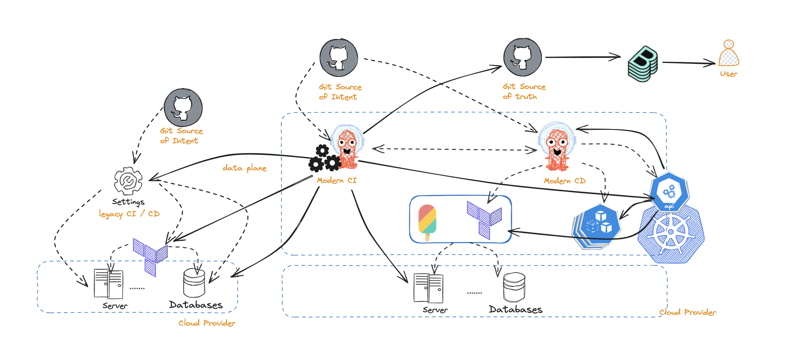
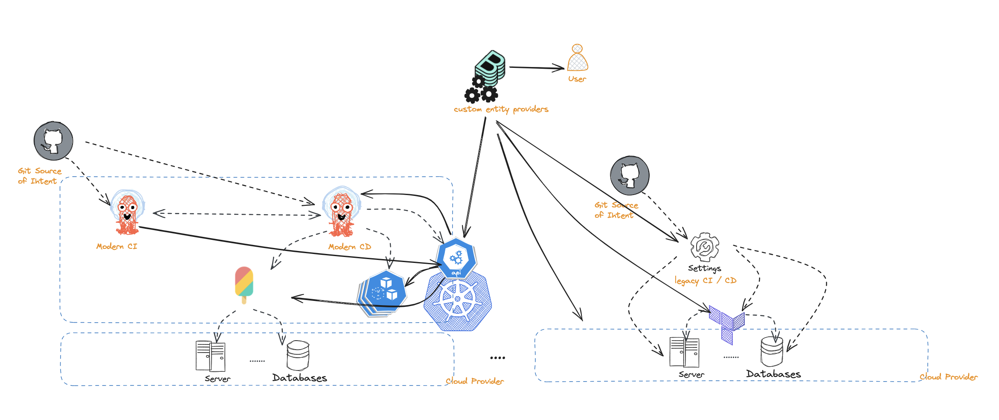

*Disclaimer: CNOE makes strong assumptions about using a subset of open source technologies when building Internal Developer Platforms (IDPs). Recommendations made and patterns discussed are hence centered around the exact tooling that CNOE adopts to implement a capability within an IDP. In this particular post, we assume Kubernetes as the orchestrator platform, Backstage as the technology that implements the developer portal capability, Argo CD for continuous delivery, and Crossplane or Terraform for infrastructure as code (IaC). Capability and technology names may be used interchangeably in the blog post but practices discussed are primarily around the specific set of technologies named earlier.*

## Establishing the source of truth

There are different approaches to representing entities like Kubernetes objects and cloud resources in Backstage. In such context, *platform engineers need to optimize for creation of reliable data*. The last thing you as a platform provider want to see happen is to lose trust of end users because you are displaying incorrect information. There are however, a number of key decisions to be made when building entity representations in Backstage. Particularly:

1. What gets represented in Backstage and what doesn't
2. How to ensure the Backstage entity offers an accurate representation of its real world counterpart
3. What establishes the source of truth for an entity

Embracing GitOps practices, the answer to that last question may sound rather trivial: *GIT, git is obviously the source of truth, since, you know ... GitOps!*

However, while git represents the intended source of truth, truth is actually realized where the resource is deployed, revealing its beloved *resource status*. That is why you may hear people sarcastically refer to git as the *source of hope* in GitOps.

Our current collective of practices reveals that there is no silver bullet when deciding entity representations in a developer portal. What establishes the actual source of truth, from which Backstage entity representations to be drawn, primarily depends on company practices and tools DevOps teams have available to them.

If you operate a Hub and Spoke model, where a single control plane cluster is responsible for handling platform requirements and separate compute clusters handle the actual workload, the hub cluster could very well become the data source for the Backstage entities. On the other hand, if you operate a federated environment where control plane and data plane workloads are scattered across multiple clusters, Backstage could become the unifier that implements custom entity providers to pull and consolidate data from multiple data sources (i.e. the set of clusters with the right data). In a third approach, the CI may take on the job of hydrating entity definitions with metadata and status information it collects from several data sources, eventually pushing the constructed entity to another repository where it can be observed.

Next we discuss these approaches in more details.

## Use your existing CI/CD pipelines to construct the source of truth
Starting from the specification of entities and infrastructure resources in a
git repository, this approach utilizes tasks in the CI to hydrate entities with
information on entity relations, extra metadata, and status of deployed
resources. To avoid conflating user changes and automated CI changes, the
hydrated entities are often kept in a separate git repository that mirrors and
expands entities in the original git repository with intended application
specifications.

On the positive side:

* This is a relatively simple approach and works for smaller teams with smaller number of applications or systems
* Having a second git repository to capture the end state of an entity stays closer to the core GitOps practices
* Does not require significant modification to the developer portal

On the negative side:

* There is inherent duplications that are happening
* Adding custom metadata by application teams is not as trivial as it requires making changes to the integration workflow, thus bringing load and demand to the DevOps teams
* Less abstraction in place as end application users are directly exposed to the yaml specification of the entities
* Does not scale well as the number of systems and entities grow

## Use a central control plane as the source of truth

The hub and spoke model is the most advocated for model when applying GitOps practices. Your control plane cluster runs and manages your platform tools, your CI, your CD, developer portal, infrastructure as code tooling, etc.

On the positive side:

* There really is a single place to inspect the status of entities. E.g., Argo applications can tell you the status of deployed applications. You can also inspect the status of workflows, infrastructure resources, and any other entity that the control plane cluster manages.
* You can use the Backstage Kubernetes plugin seamlessly and maybe with some little tweaks. Alternatively this can be achieved by introducing fairly light-weight Backstage custom entity providers which pull and show the status of entities in the Backstage portal.
* In an organization with a diverse set of distributed systems, the control plane cluster can be used as the integration layer by wrapping legacy APIs and or implementing native controllers.

On the negative side:

* Most organizations do not have a central control plane and adopting one as the source of truth is often a significant change, especially if an organization is early in their GitOps transition.
* For organizations deep into a federated model of operation with different teams running and managing their platforms separately and rather independently, it could be challenging to offer a single control plane that aggregates data across all teams.
* Management of change could become cumbersome. Existence of a single control plane could create bottlenecks where changes occur to a set of entities or practices. Changes in organizations or systems may result in changes to various entities managed across several teams. Bringing GitOps practices to the mix, this requires chains of approvals to happen across multiple entities and across several repositories for deployments to start flowing. Depending on the size of the organization, this could lead to organizational nightmares.
* You may need to jump through a few hoops before getting from the representation of the application, to the actual deployment of it, e.g., going from git to your continuous delivery and from there to your target cluster.

## Use Backstage as the source of truth

Where control planes and compute workloads are scattered, the unifying layer lies in the developer portal, i.e. Backstage. Hence, it is reasonable to construct an entity by collecting and aggregating data from various data sources, each providing partial data on the entity, making Backstage be the source of truth. This generally starts with Backstage querying git for the entities that exist. Then using the identifiers for the entities to collect metadata on how the entity contributes to a system. This could involve querying the control plane clusters and the workload clusters via some custom entity provider that looks for certain information and putting collected pieces together to come close to the core promise of a developer portal, *providing reliable information* on the entities.

On the positive side:

* This model copes better with legacy systems
* Users are not exposed to and often times not even aware of the underlying platforms, hence underlying platform and tooling is more rigorously abstracted away
* Changes to the system are only isolated to the entities of the particular system as managed by the underlying resources and platform. This causes less chaos when definitions, metadata, or properties of entities need to change.

On the negative side:

* The git service may not be able to scale, technically or financially.  This is particularly because Backstage may hit the git service endpoints too frequently and exceed the API limits. This could cause delays in displaying data for end users or display wrong information if partially available data is mishandled. This can be mitigated via approaches like using an eventing mechanism to notify Backstage of changes, or alternatively to store entity definitions in an alternative storage space (e.g. Amazon S3). There are challenges to such approaches too, for example when using Amazon S3, change history will be lost. Also, using an eventing mechanism could introduce security challenges that we discuss next.
* Securing Backstage could be a challenge. For Backstage to proactively receive updates on entity changes, it would work best to configure event hooks to provide callbacks to Backstage when changes occur. Backstage, being the entry point for user workflows, sits on the critical path of platform operations. As such, platform engineers need to solve for a chicken and egg problem by deciding how to expose Backstage endpoints to receive events and yet to limit access for security reasons. The authentication methods that GitHub supports may not satisfy the security standards that an organization requires.
* Changes to entities may not be as trivial. DevOps engineers need to manage entities that they may not control. For example, if a new mandatory field is introduced to a catalog file, DevOps engineers may need to talk to the respective repository owners, create a PR, then get approval for all affected repositories.

## Conclusion

We discussed multiple approaches to creating reliable representation of system entities in the developer portals. We do not necessarily recommend one approach over another, but it is important to find the right approach given the patterns and practices in your organization. It is also worth noting that you can choose to combine multiple approaches depending on the requirements of your teams. For example, while continuous integration can still be used to construct the actual state of the world by collecting status data and other related information, Backstage extensions can be introduced to expand on entity relations, providing better representation of a system. Stating the obvious here, but your proper selection of patterns that work for you will go a long way in increasing your overall team velocity down the road.

Reach out on [#cnoe-interest](https://cloud-native.slack.com/archives/C05TN9WFN5S) CNCF slack channel to share thoughts and get involved in developing CNOE.

