## Introduction

In [Part 1 of our Argo CD benchmarking blog post](https://aws.amazon.com/blogs/opensource/argo-cd-application-controller-scalability-testing-on-amazon-eks/), we analyzed the impacts of various Argo CD configuration parameters on the performance of Argo CD. In particular we measured the impact of _status and operation processes_, _client QPS, burst QPS_, and _sharding_ algorithms on the overall synchronization and reconciliation behavior in Argo CD. We showed that using the right configuration and sharding strategy, particularly by properly setting client and burst QPS, as well as by splitting the workload across multiple workload clusters using Argo CD sharding, overall sync time can be improved by a factor of 4.

Here, and in Part 2 of our scalability work, we push our scalability experiments for Argo CD further. In particular, among other tests, _we run our scalability metrics against a maximum of 500 workload clusters, deploying 50,000 Argo applications_. This, to the best of our knowledge, sets the largest scalability testing ever done for Argo CD. We also report on a much deeper set of sharding experiments, utilizing different sharding algorithms for distribution of load across 100 workload clusters. While we report on running our experiments against a legacy sharding algorithm and a round robin algorithm that already exist in [Argo CD 2.8](https://github.com/argoproj/argo-cd/releases/tag/v2.8.0), we also discuss results of workload distribution _using 3 new sharding algorithms_ we developed in collaboration with RedHat, namely: _a greedy minimum algorithm_, _a weighted ring hash algorithm_, and _a consistent hash with bounded loads algorithm_. We show that, depending on the optimization goals one has in mind, choosing from the new sharding algorithms can improve CPU utilization by a factor of 3 and reduce application-to-shard rebalancing by a factor of 5, significantly improving the performance of a highly distributed and massively scaled Argo CD deployment.

## Experiment 1: How Client QPS/Burst QPS affects the Kubernetes API Server

** <u>Objective:</u> **

The objective of the first experiment is to understand the impact of QPS & Burst Rate parameters on 1/Kubernetes control plane for both the Argo CD cluster and the remote application clusters, and 2/ overall sync duration for Argo CD applications. To understand the impact on Kubernetes API server, we observed following control plane metrics: 
- Latency (`apiserver_request_duration_seconds_bucket`)
- Throughput (`apiserver_request_total`)
- Error Rate (`apiserver_request_total{code=~"[45].."}`) for any request
  returning an error code 4xx or 5xx.

To analyze impact on application synchronization, we observed `Sync Duration` and `No. of Goroutines` Argo CD server metrics.

** <u>Test Infrastructure:</u> **

In terms of test infrastructure and workload configuration, we had one central Amazon EKS cluster with Argo CD Server running on it. This central cluster connected with three remote Amazon EKS clusters with each one of them hosting 5000 Argo CD applications. Each application is a Configmap (2KB) provisioned in a dedicated namespace. All of the four clusters, one central and three remote, had a dedicated monitoring stack composed of Prometheus and Grafana installed on them.

** <u>Observations:</u> **

** Observation 1 - Impact on Argo CD application synchronization **

The table and graphs below highlight the impact of QPS & Burst Rate on “Sync Duration” as well as the average and maximum no. of goroutines active during the test run.

<table>
  <tr>
   <td><strong>QPS</strong>
   </td>
   <td><strong>Burst Rate</strong>
   </td>
   <td><strong>Sync Duration</strong>
   </td>
   <td><strong>No. of GoRoutines (Avg)</strong>
   </td>
   <td><strong>No. of GoRoutines (Max)</strong>
   </td>
  </tr>
  <tr>
   <td>50
   </td>
   <td>100
   </td>
   <td>61.5 mins
   </td>
   <td>1760
   </td>
   <td>1810
   </td>
  </tr>
  <tr>
   <td>100
   </td>
   <td>200
   </td>
   <td>29.5 mins
   </td>
   <td>2120
   </td>
   <td>2310
   </td>
  </tr>
  <tr>
   <td>150
   </td>
   <td>300
   </td>
   <td>19.0 mins
   </td>
   <td>2520
   </td>
   <td>2760
   </td>
  </tr>
  <tr>
   <td>200
   </td>
   <td>400
   </td>
   <td>18.0 mins
   </td>
   <td>2620
   </td>
   <td>2780
   </td>
  </tr>
  <tr>
   <td>250
   </td>
   <td>500
   </td>
   <td>17.5 mins
   </td>
   <td>2590
   </td>
   <td>2760
   </td>
  </tr>
  <tr>
   <td>300
   </td>
   <td>600
   </td>
   <td>18.0 mins
   </td>
   <td>2540
   </td>
   <td>2760
   </td>
  </tr>
</table>

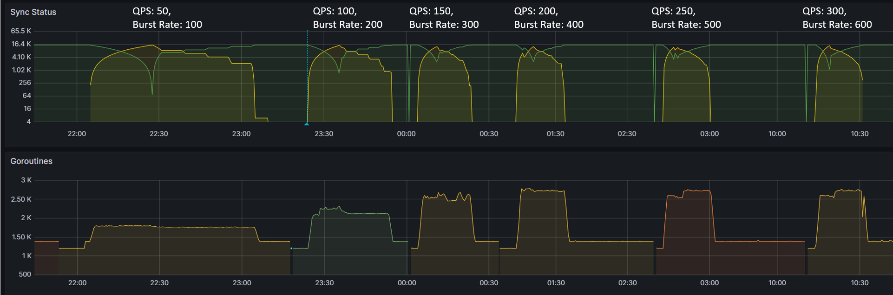

To summarize, during the test, we immediately observed ~52% reduction (from 61.5 mins to 29.5 mins) as we increased QPS & Burst Rate from default values to 100 & 200 respectively. This also correlated with corresponding increase in no. of Goroutines processing application synchronization requests. The benefit from increasing values of these parameters started providing diminishing returns with subsequent runs. Beyond QPS & Burst rate of 150 & 300 respectively, there wasn’t measurable improvement observed. This again correlated with number of Goroutines actively processing sync requests.

** Observation 2 - Impact on central Amazon EKS cluster control plane hosting Argo CD Server **

The table and graphs below highlights the impact of QPS & Burst Rate on throughput and latency from Amazon EKS control plane hosting Argo CD Server. We can observe an increase in request rate per second to the Kubernetes control plane which is in line with previous observations related to increase in no. of goroutines processing the sync requests. The increased activity related to sync operations translates into increased requests to Amazon EKS control plane tapering off at QPS of 150 and Burst Rate of 300. Additional increase in QPS and Burst Rate parameters doesn’t noticeably impact request rate per second.

<table>
  <tr>
   <td><strong>QPS</strong>
   </td>
   <td><strong>Burst Rate</strong>
   </td>
   <td><strong>Request Rate (Max)</strong>
   </td>
   <td><strong>Latency p50 (Max)</strong>
   </td>
   <td><strong>Latency p90 (Max)</strong>
   </td>
  </tr>
  <tr>
   <td>50
   </td>
   <td>100
   </td>
   <td>27.2 rps
   </td>
   <td>13.0 ms
   </td>
   <td>22.6 ms
   </td>
  </tr>
  <tr>
   <td>100
   </td>
   <td>200
   </td>
   <td>31.9 rps
   </td>
   <td>13.3 ms
   </td>
   <td>23.1 ms
   </td>
  </tr>
  <tr>
   <td>150
   </td>
   <td>300
   </td>
   <td>39.8 rps
   </td>
   <td>14.3 ms
   </td>
   <td>24.0 ms
   </td>
  </tr>
  <tr>
   <td>200
   </td>
   <td>400
   </td>
   <td>41.4 rps
   </td>
   <td>14.9 ms
   </td>
   <td>24.4 ms
   </td>
  </tr>
  <tr>
   <td>250
   </td>
   <td>500
   </td>
   <td>39.0 rps
   </td>
   <td>15.1 ms
   </td>
   <td>24.4 ms
   </td>
  </tr>
  <tr>
   <td>300
   </td>
   <td>600
   </td>
   <td>40.7 rps
   </td>
   <td>16.4 ms
   </td>
   <td>34.5 ms
   </td>
  </tr>
</table>

From a latency perspective, overall during the course of testing, average (p50) duration remained within range of 13 to 16.5 ms and p90 latency within 22 ms to 34 ms. The error rate remained consistently around ~0.22% with a brief spike to ~0.25% (increase of ~0.03%).

The relatively low latency numbers and low error rate (&lt;0.25%) indicates that Amazon EKS control plane was able to handle the load comfortably. Increasing QPS and Burst rate only would stretch the control plane to a limited extent indicating it still has resources to process additional requests as long as Argo CD server can generate request traffic.

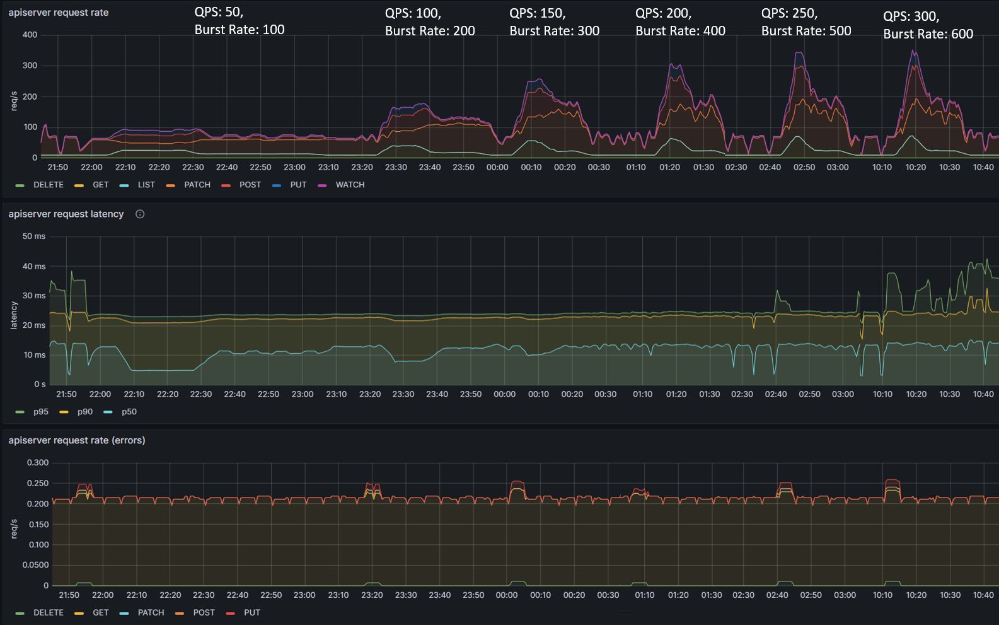

** Observation 3 - Impact on remote Amazon EKS cluster control plane hosting applications **

We had similar observations regarding latency, throughput and error rate for Amazon EKS control plane of remote application clusters. These are the clusters hosting ~5000 Argo CD applications each and connected to Argo CD Server on the central Amazon EKS cluster. The throughput peaked at ~35 requests per second with QPS and burst rate of 150 & 300 respectively. From an average latency perspective, it remained consistently within single digit millisecond hovering around ~5ms.

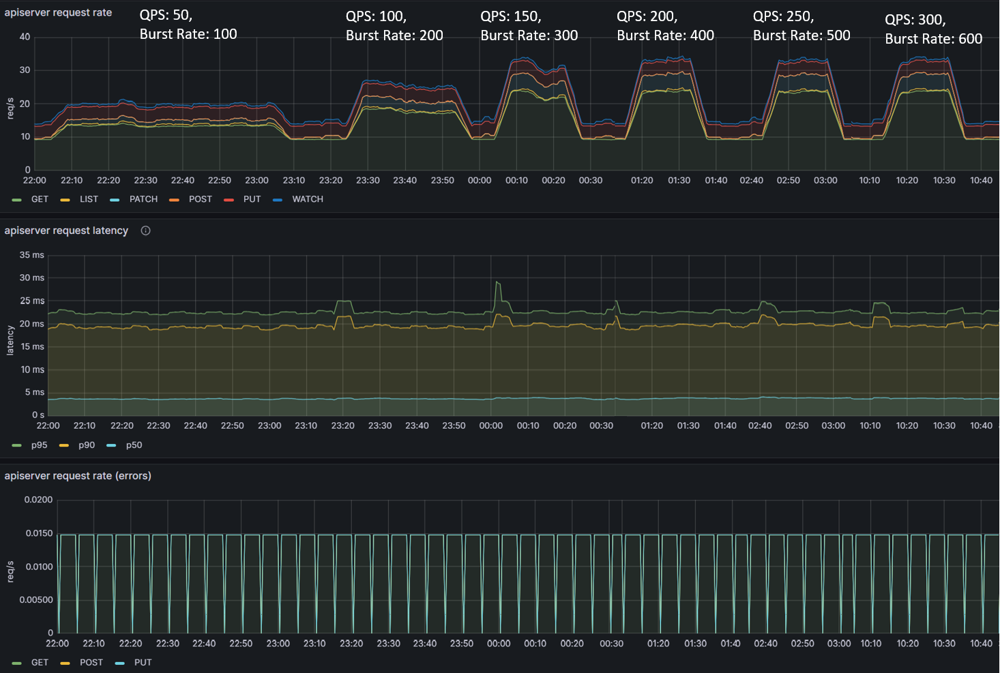

## Experiment 2: Revisiting Status/Operation Processors

** <u>Objective:</u> **

The objective of the second experiment is to explore why status/operation processors did not have an effect on sync times of our previous experiments. It is possible that the simple nature of ConfigMap applications which takes &lt;1s to deploy is causing this behavior. Most real world applications would consist of tens to hundreds of resources taking longer to be deployed. During this experiment, we will simulate a more complex application which takes longer to deploy than the original ConfigMap application.

** <u>Test Infrastructure:</u> **

Central Argo CD cluster running on a single m5.2xlarge managing 100 application clusters. In order to simulate larger applications, each application will execute a PreSync job which waits 10 seconds before deploying the original ConfigMap application.

Example of the PreSync Job:

```
apiVersion: batch/v1
kind: Job
metadata:
 name: before
 annotations:
   argocd.argoproj.io/hook: PreSync
   argocd.argoproj.io/hook-delete-policy: HookSucceeded
spec:
 template:
   spec:
     containers:
     - name: sleep
       image: alpine:latest
       command: ["sleep", "10"]
     restartPolicy: Never
 backoffLimit: 0
```

** <u>Observations: </u> **

** Observation 1 - Syncing never finishes and require a restart of the application controller to continue syncing **

The screenshot below shows that from the start of the sync test at 17:02 till around 17:41, the sync process was deadlocked. We observed no changes to synced apps and the `app_operation_processing_queue` was pinned at 10k operations.

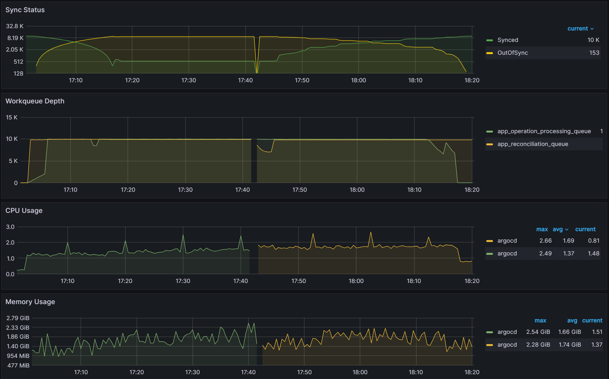

Looking at the Argo CD console for a single application we see that the PreSync job finished 17 mins ago, but the application stayed in the Syncing phase.

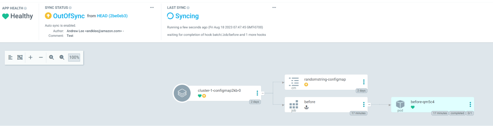

** Observation 2: There is a link between client QPS/burst QPS and operation/status processor settings **

In order to fix the sync freezing issue, we increased the client QPS/burst QPS from the default 50/100 to 100/200. After the change we were able to collect data on operation/status processor settings.

<table>
  <tr>
   <td>operation/status processors: <strong>25/50</strong><br/>
Sync time: <strong>45 mins</strong>
   </td>
   <td>operation/status processors: <strong>50/100</strong><br/>
Sync time: <strong>30 mins</strong>
   </td>
  </tr>
  <tr>
   <td>


   </td>
   <td>


   </td>
  </tr>
</table>

We can see that there is a link between status/operation processors and client QPS/burst QPS settings. Changing one or the other could be required to improve sync times and Argo CD performance depending on your environment. Our recommendation is to first change the status/operation processor settings. If you run into Argo CD locking up or the performance not increasing further, and you have sufficient resources, you can try increasing the client QPS/burst QPS. But as mentioned in the first experiment, ensure you are monitoring the k8s api-server.

## Experiment 3: Cluster Scaling

** <u>Objective:</u> **

The following experiment is designed to test the compute demands of the Argo CD app controller managing clusters with more than 100 applications.

** <u>Test Infrastructure:</u> **

Central Argo CD cluster with 10 app controller shards running on a single m5.2xlarge node managing 100/250/500 application clusters and 10k 2KB ConfigMap applications.

** <u>Observations:</u> **

From earlier experiences, we can see that when managing 100 clusters, we are close to the limit of a single m5.2xlarge node. As we push further and to 250/500 clusters, we have two observations. The first observation is that the graph data is less smooth than the sync test of 100 clusters. This can indicate that Prometheus is running out of compute as Argo CD is consuming most of it. Please note that we are not using any resource limits/requests in our experiments. If proper resource limits/requests are set, most likely we would only see performance issues with Argo CD and not Prometheus, when operating at the limit of your compute resources. The second observation is that on both the 250/500 cluster tests, there are some drop off in metric data. For the 250 cluster test, there is a blip at the 16:16 mark for Memory Usage. For the 500 cluster test there are blips in data at the 21.05 mark on the Workqueue depth, CPU usage, and Memory usage. In spite of these observations, the sync process completes in a reasonable time.

<table>
  <tr>
   <td>
    Clusters: <strong>100</strong><br/>  
    Sync time: <strong>9 mins</strong>
   </td>
   <td>
    Clusters: <strong>250</strong><br/>
    Sync time: <strong>9 mins</strong>
   </td>
   <td>
    Clusters: <strong>500</strong><br/>
    Sync time: <strong>11 mins</strong>
   </td>
  </tr>
  <tr>
   <td>
    
   </td>
   <td>
    
   </td>
   <td>
    
   </td>
  </tr>
</table>
From this experiment, you can see that as you approach the limit of your compute resources, Argo CD and other applications running in your k8s environment could experience issues. It is recommended that you set proper resource limits/requests for your monitoring stack to ensure you have insights into what could be causing your performance issues. 

## Experiment 4: Application Scaling

** <u>Objective:</u> **

This experiment is meant to push the Argo CD app controller beyond 10k applications. As the previous rounds of experiments were performed with 10k apps, the intention of these experiments is to scale the Argo CD app controller up to 50k apps.

** <u>Test Infrastructure:</u> **

We will be performing this experiment on a Central Argo CD cluster with 10 app controller shards and 500 downstream application clusters. As we scale up the applications up to 10k,15k,20k,25k,30k,50k 2KB ConfigMap applications, we will add additional m5.2xlarge node(s) to the Argo CD cluster. 

** <u>Observations:</u> **

<table>
  <tr>
   <td width="33%" valign="top">Sync test at 15k applications with a single m5.2xlarge. You can see blips in data indicating unhealthy behavior on the cluster.
   </td>
   <td width="33%" valign="top">CPU and Memory Usage is near 100% utilization of 8 vCPUs and 30 GB of memory.
   </td>
   <td width="33%" valign="top">After adding another node for a total of two m5.2xlarge, we were able to perform a sync in <strong>9 mins</strong>.
   </td>
  </tr>
  <tr>
   <td valign="top">

   </td>
   <td valign="top">

   </td>
   <td valign="top">

   </td>
  </tr>
</table>

After adding another node, we were able to continue our application scaling tests. You can see in the graphs below that syncing 20k and 25k apps was not a problem. The sync test of 30k apps shown on the third graph shows some blips in data, indicating that we are at the limits of two nodes.

<table>
  <tr>
   <td width="33%" valign="top">Apps: <strong>20000</strong><br/>
Sync time: <strong>12 mins</strong>
   </td>
   <td width="33%" valign="top">Apps: <strong>25000</strong><br/>
Sync time: <strong>11 mins</strong>
   </td>
   <td width="33%" valign="top">Apps: <strong>30000</strong><br/>
Sync time: <strong>19 mins</strong>
   </td>
  </tr>
  <tr>
   <td valign="top">

   </td>
   <td valign="top">

   </td>
   <td valign="top">

   </td>
  </tr>
</table>

For the final test in this experiment, we pushed the cluster to sync 50k apps.

<table>
  <tr>
   <td width="33%" valign="top">While the cluster was able to manage reconciliation for the 50k apps as shown by a stable Sync Status graph from 8:40, when we start the sync at the 9:02 mark, you can see unhealthy behavior in the graph data.
   </td>
   <td width="33%" valign="top">From examining the CPU/Memory Usage, you can see we have 100% CPU utilization across the cluster.
   </td>
   <td width="33%" valign="top">After scaling the cluster to three m5.2xlarge nodes, we were able to perform a sync in <strong>22 mins</strong>.
   </td>
  </tr>
  <tr>
   <td valign="top">

   </td>
   <td valign="top">

   </td>
   <td valign="top">

   </td>
  </tr>
</table>

From the scaling tests, we can see that the Argo CD app controller scales effectively by adding compute resources as we increase the number of applications to sync.

## Experiment 5: How Many Shards?

** <u>Objective:</u> **

In previous experiments, we utilized ten app controller shards running across multiple nodes. In this experiment, we will explore how the number of app controller shards affect performance.

** <u>Test Infrastructure:</u> **

Central Argo CD cluster with 3, 6, 9 app controller shards running on 3 m5.2xlarge node(s) managing 500 application clusters and 50k 2KB ConfigMap applications.

** <u>Observations:</u> **

For the baseline of three shards it took <strong>75 mins</strong> to perform a sync. Adding additional shards saw further improvements with a sync time of <strong>37 mins</strong> for six shards and a sync time of <strong>21 mins</strong> for nine shards. Further increasing shards beyond nine did not yield any improvements.

<table>
  <tr>
   <td width="33%" valign="top">Shards: <strong>3</strong><br/>
Sync time: <strong>75 mins</strong>
   </td>
   <td width="33%" valign="top">Shards: <strong>6</strong><br/>
Sync time: <strong>37 mins</strong>
   </td>
   <td width="33%" valign="top">Shards: <strong>9</strong><br/>
Sync time: <strong>21 mins</strong>
   </td>
  </tr>
  <tr>
   <td valign="top">

   </td>
   <td valign="top">

   </td>
   <td valign="top">

   </td>
  </tr>
</table>

Looking at the CPU and Memory utilization, you can see that adding shards can improve performance only if there are free resources to consume. With the baseline of three shards, CPU utilization of the nodes are well below eight vCPU that each node is allocated. As we add more shards, we can see CPU utilization increasing until we are close to 100% CPU Utilization with nine shards. Adding any more shards would not yield any performance benefits unless we add more nodes.

<table>
  <tr>
   <td width="33%" valign="top">Shards: <strong>3</strong>
   </td>
   <td width="33%" valign="top">Shards: <strong>6</strong>
   </td>
   <td width="33%" valign="top">Shards: <strong>9</strong>
   </td>
  </tr>
  <tr>
   <td valign="top">

   </td>
   <td valign="top">

   </td>
   <td valign="top">

   </td>
  </tr>
</table>

From the experiments, the Argo CD app controller sharding mechanism is able to scale as you add more compute resources. Sharding allows both horizontal and vertical scaling. As you add more shards, you can horizontally scale by adding more nodes or vertically scale by utilizing a larger node with more compute resources.

## Experiment 6: Sharding Deep Dive

** <u>Objective:</u> **

With the release of [Argo CD 2.8](https://github.com/argoproj/argo-cd/releases/tag/v2.8.0), a new sharding algorithm: round-robin was released. The existing legacy sharding algorithm performed a modulo of the number of replicas and the hash sum of the cluster id to determine the shard that should manage the cluster. This led to an imbalance in the number of clusters being managed by each shard. The new round-robin sharding algorithm is supposed to ensure an equal distribution of clusters being managed by each shard. We will also introduce 3 new algorithms: greedy minimum, weighted ring hash, and consistent hash with bounded loads. This experiment will evaluate all the algorithms on shard balance, application distribution and rebalancing on changes to the environment.

** <u>Test Infrastructure:</u> **

Central Argo CD cluster with 10 app controller shards running on 1 m5.2xlarge node managing 100 application clusters and 10k 2KB ConfigMap applications.

** <u>Observations:</u> **

Note: For all the observations, we start monitoring-period when we see items in the operations queue. We end the monitoring-period when all the applications are synced. We then look at the avg metric of CPU/Memory usage during the monitoring-period. 

** Legacy ** 

The graph below shows the CPU Usage/Memory Usage of the 10 different Argo CD App Controller shards. Looking at the avg, you can see a large variation to how much each shard is utilizing its resources. To make an accurate comparison between the different sharding methods, we calculate _the variability_ by determining the range of the data for both avg CPU usage and Memory usage. The CPU usage variability is calculated by taking the shard with the highest CPU usage and subtracting it from the shard with the least CPU usage: `0.55 - 0.23 = 0.32`. The Memory usage variability is `452 MiB - 225 MiB = 227 MiB`.

** Variability: **

<table>
  <tr>
    <td>
      CPU:
    </td>
    <td>
      0.32
    </td>
  </tr>
  <tr>
    <td>
      Memory:
    </td>
    <td>
      227 MiB
    </td>
  </tr>
</table>

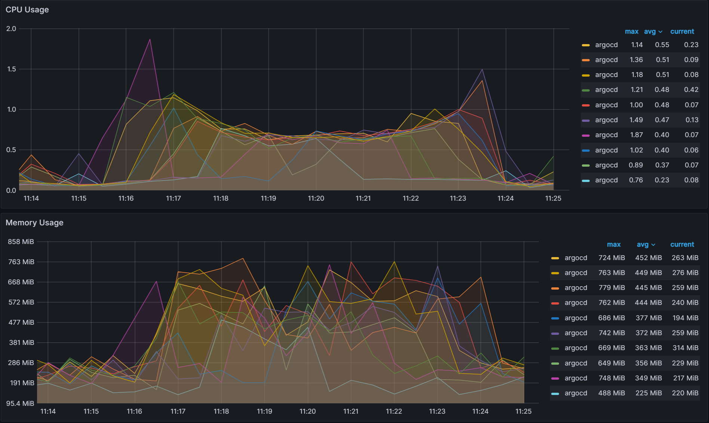

** Round-Robin **

With the newly introduced Round-Robin algorithm, you can see improved balance across the shards.

** Variability: **

<table>
  <tr>
    <td>
      CPU:
    </td>
    <td>
      0.02
    </td>
  </tr>
  <tr>
    <td>
      Memory:
    </td>
    <td>
      110 MiB
    </td>
  </tr>
</table>

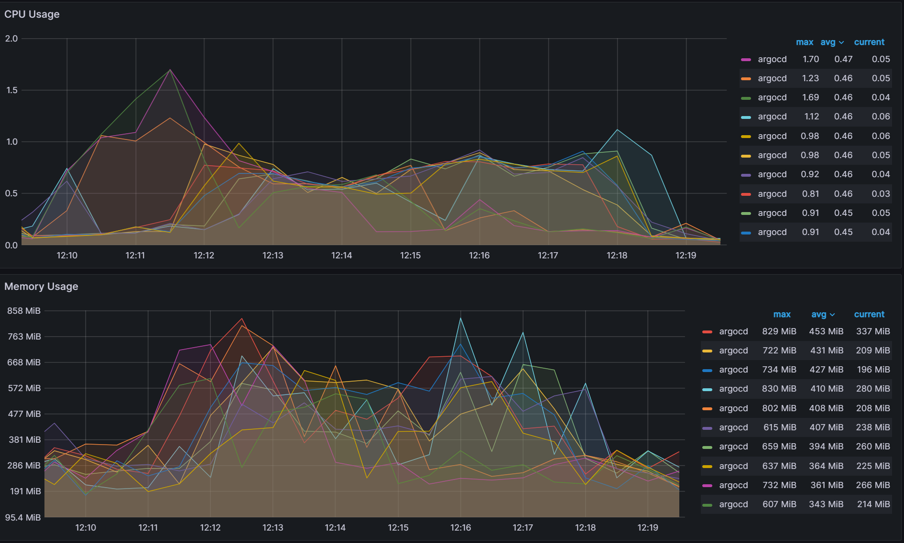

** Better but not perfect **

The new round-robin algorithm does a better job of keeping the number of clusters balanced across the shards. But in a real world environment, you would not have an equal number of applications running on each cluster and the work done by each shard is determined not by the number of clusters, but the number of applications. A new experiment was run which deploys a random number of applications to each cluster with the results below. Even with the round-robin algorithm, you can see some high variability in CPU/Memory usage.

** Variability: **

<table>
  <tr>
    <td>
      CPU:
    </td>
    <td>
      0.27
    </td>
  </tr>
  <tr>
    <td>
      Memory:
    </td>
    <td>
      136 MiB
    </td>
  </tr>
</table>

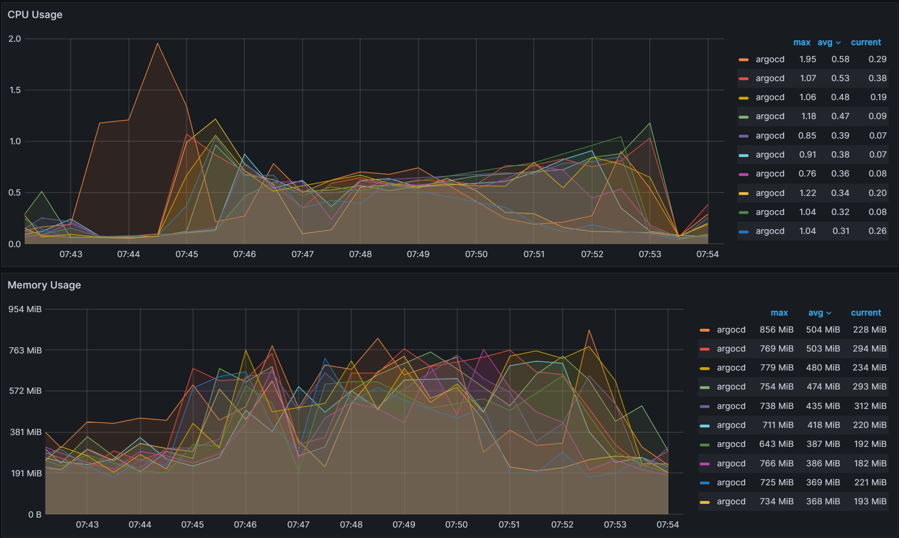

** Greedy Minimum Algorithm, sharding by the Number of Apps **

A new algorithm is introduced in order to shard by the number of applications that are running on each cluster. It utilizes a greedy minimum algorithm to always choose the shard with the least number of apps when assigning shards. A description of the algorithm is shown below: 

Iterate through the cluster list:

```
1. Determine the number of applications per cluster.
2. Find the shard with the least number of applications.
3. Add the number of applications to the assigned shard.
```

The same experiment with a random number of applications running on each cluster is run again with the results shown below. With the new algorithm, there is better balance across the shards.

** Variability: **

<table>
  <tr>
    <td>
      CPU:
    </td>
    <td>
      0.06
    </td>
  </tr>
  <tr>
    <td>
      Memory:
    </td>
    <td>
      109 MiB
    </td>
  </tr>
</table>

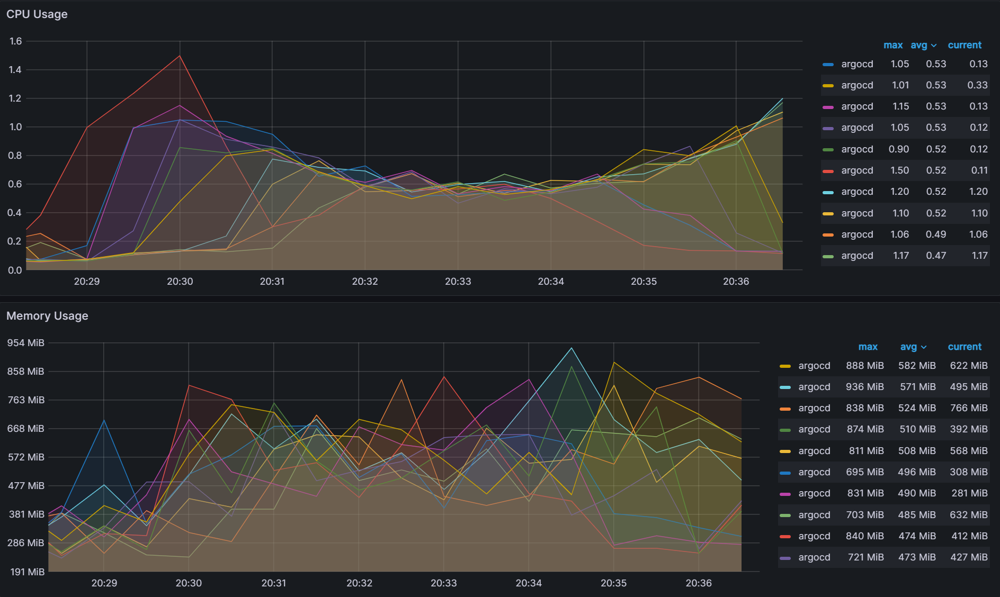

While there is better balance when utilizing the greedy minimum algorithm, there is an issue when changing any aspect of the Argo CD sharding parameters. If you are adding shards, removing shards, adding clusters and/or removing clusters, the algorithm can trigger large scale changes in the shard assignments. Changes to the shard assignments cause shards to waste resources when switching to manage new clusters. This is especially true when utilizing ephemeral clusters in AI/ML training and big data operations where clusters come and go. Starting from the previous experiment from before, we changed the number of shards from 10 to 9 and observed over <strong>75 cluster to shard assignment changes</strong> out of 100 clusters excluding the changes associated with the removed shard. 

** Weighted Ring Hash **

In order to decrease the number of shard assignment changes, a well known method called consistent hashing is explored for our use case ([Reference](https://www.cs.princeton.edu/courses/archive/fall09/cos518/papers/chash.pdf)). Consistent hashing algorithms utilize a ring hash to determine distribution decisions. This method is already widely utilized by network load balancing applications to evenly distribute traffic in a distributed manner independent of the number of servers/nodes. By utilizing a ring hash algorithm to determine shard assignments, we were able to decrease the number of shard assignment changes when we changed the number of shards from 10 to 9. We observed <strong>48 cluster to shard assignment changes</strong>, excluding the changes associated with the removed shard.

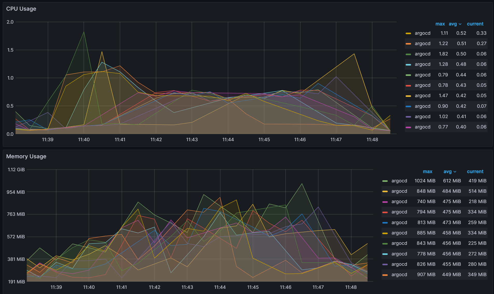

To ensure balance, weighting is applied at each shard assignment to ensure the shard with the least number of apps is given the highest weight when choosing shards for assignment. The balancing is not perfect as you can see that CPU variability has increased from the greedy minimum algorithm of 0.06 to 0.12. 

** Variability: **

<table>
  <tr>
    <td>
      CPU:
    </td>
    <td>
      0.12
    </td>
  </tr>
  <tr>
    <td>
      Memory:
    </td>
    <td>
      163 MiB
    </td>
  </tr>
</table>

** Consistent Hash with Bounded Loads **

The ring hash algorithm was never designed to allow dynamically updating the weights based on load. While we were able to utilize it for this purpose, we looked at another algorithm called Consistent Hashing with Bounded Loads ([Reference](https://arxiv.org/abs/1608.01350)) which looks to solve the problem of consistent hashing and load uniformity. By utilizing this new algorithm, we were able to significantly decrease the redistribution of cluster to shard assignments. When we change the number of shards from 10 to 9, we only observed <strong>15 cluster to shard assignment changes</strong> excluding the changes associated with the removed shard.

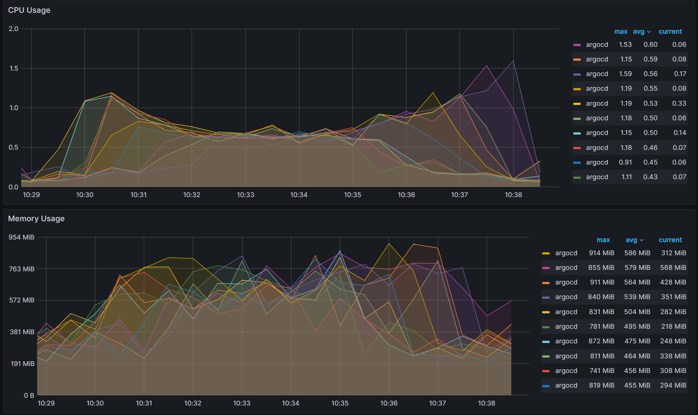

The trade off is slightly worse cluster/app balancing than the weighted ring hash which increased CPU variability from 0.12 to 0.17.

** Variability: **

<table>
  <tr>
    <td>
      CPU:
    </td>
    <td>
      0.17
    </td>
  </tr>
  <tr>
    <td>
      Memory:
    </td>
    <td>
      131 MiB
    </td>
  </tr>
</table>

There are no direct recommendations about which algorithm you should utilize, as each of them have their pros and cons. You should evaluate each for your environment whether you are looking for strict balancing of clusters/apps across the shards or whether you want to minimize the impact of making frequent changes to your Argo CD environment. 

## Conclusion

In this blog post, we continued our scalability tests of the Argo CD app controller by answering some questions we had from our first scalability tests about the common scalability parameters. We showed how QPS/Burst QPS affects the k8s api server, determined why status/operation processors did not affect our previous scalability tests, and how those parameters are linked together. We then continued our scalability tests by pushing the Argo CD app controller to 500 clusters and 50,000 apps. We ended our tests by showing that a key component of scaling the Argo CD app controller is how it performs sharding. By doing a deep dive into how the app controller performs sharding we also determined some ways to improve sharding by adding in and evaluating new sharding algorithms. We are currently evaluating how to contribute these changes back to Argo CD. Stay tuned for those contributions and reach out on the CNCF[ #argo-sig-scalability](https://cloud-native.slack.com/archives/C04SURUPDL2) or the [#cnoe-interest](https://cloud-native.slack.com/archives/C05TN9WFN5S) Slack channel to get help optimizing for your use-cases and scenarios.
