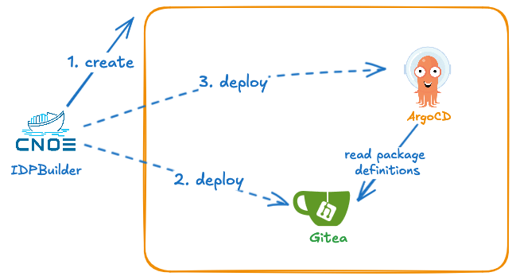

Creating and managing an internal developer platform (IDP) is a complex and time-consuming challenge. As outlined on our website and in the [CNCF Platforms white paper](https://tag-app-delivery.cncf.io/whitepapers/platforms/), IDPs consist of [capabilities](https://cnoe.io/docs/category/technology-capabilities). This centralized system facilitates developers in designing, building, deploying, and managing applications and services within an organization. It offers a suite of tools, APIs, and services that streamline the development process by providing essential capabilities.


[idpBuilder](https://cnoe.io/docs/reference-implementation/idpbuilder) is meant for platform engineers looking to quickly spin up a repeatable IDP environment. With just a single binary and Docker as the only dependency, idpBuilder allows you to create a fully functional IDP leveraging popular open source projects such as Kubernetes, ArgoCD, and Backstage.

For most use cases, you need to run one command to get started. For example, to get started with the CNOE reference implementation all you have to run is:

```bash
idpbuilder create --use-path-routing \
  --package https://github.com/cnoe-io/stacks//ref-implementation
```




In addition to its simplicity, idpBuilder offers the following key benefits:

1. Rapid Deployment: Create a reference implementation of an IDP with minimal setup time.
2. CI Integration: Easily incorporate idpBuilder into your continuous integration workflows for comprehensive testing.
3. Local Development: Provide IDP engineers with a consistent and easily reproducible local development environment.

Let's explore how you can use idpBuilder in your development workflow. Whether you're looking to demonstrate an IDP reference implementation, enhance your CI pipeline, or improve your local development setup, idpBuilder offers a solution that's both powerful and easy to use.


## Demo your own IDP implementation

idpBuilder comes with a set of technologies that enables GitOps workflows all contained within the ephemeral environment. Think of building your IDP solution in a box. It does this by provisioning a kind cluster, Gitea server, ArgoCD, and ingress-nginx. See[ our documentation](https://cnoe.io/docs/reference-implementation/installations/idpbuilder/usage) site for more information.

in addition, idpbuilder can copy files and Kubernetes manifests checked into Git repositories to the in-cluster Gitrea repositories. Once copied to the in-cluster repositories, ArgoCD can use them to deploy your solutions in minutes. We have examples of this in the [Stacks repository.](https://github.com/cnoe-io/stacks/tree/main/ref-implementation).  You can run them in your browser using Codespaces as well.
This approach also allows you to experiment with configuration changes and code changes without changing files checked into the external repositories because everything is contained in the cluster.

Carlos Santana does an excellent job of show this in his video. https://www.youtube.com/watch?v=e6Fvivx4Aw8


## Local Development and CI integrations

Due to the number of technologies involved and the complexity in integrating them, many organizations struggle with fragmented development environments. Different teams often work in silos, using disparate tools and workflows.
This fragmentation is a major barrier for organizations hoping to create cohesive internal developer platforms as it is difficult to design and develop features which span multiple capabilities. Furthermore, the lack of a reference development environment leads to significant inefficiencies including slower development cycles, especially for cross-capability functionality.
idpBuilder can set up identical environments for local development and CI pipelines. With idpBuilder, you get:

1. **Reduced "It Works on My Machine" Syndrome**: With consistent environments, discrepancies between local and CI setups become a thing of the past.
2. **Early Issue Detection**: Integration problems are caught earlier, saving time and resources in the long run.
3. **Improved Collaboration**: Developers can confidently work on the same project, knowing they're all using identical environments.
4. **Streamlined Workflow**: The seamless transition from local development to CI pipelines accelerates the development cycle.
5. **Local GitOps Workflow**: A zero-configuration approach to GitOps: start immediately with a pre-configured local Git server, no external repositories or credentials required.

During KubeCon 2024, AutoDesk touches on these topics and shares their experience using it for their platform development: https://www.youtube.com/watch?v=x_cTXvRgwdA


## Crossplane Testing


Another example use of idpBuilder is in development and testing with Crossplane functions. At the All Day DevOps event, Imagine Learning highlighted their use of idpBuilder:

- **Local Development**: idpBuilder deploys Crossplane, a local OCI registry, composite resource definitions, compositions, and composition functions within a single local Kubernetes environment.
- **Enhanced Security**: This setup avoids publishing images to public registries, improving security and privacy posture.
- **Local AWS Simulation**: A local stack simulates an AWS environment, enabling thorough testing without external resources.

More details about their implementation can be found in their [repository](https://github.com/blakeromano/control-plane-xfn) and their presentation at the [All Day DevOps event](https://event.alldaydevops.com/hub/events/1a51349d-007d-4e3b-994e-814bc68718e9/sessions/f5df32b1-71a6-496a-9ba8-ee2573a7fae6).


## Conclusion

idpBuilder simplifies creating and testing Internal Developer Platform Capabilities, solving common development and maintenance challenges. It allows you to rapidly deploy functional solutions with minimal setup by offering consistency across development stages.

However, idpBuilder isn't a one-size-fits-all solution. Organizations must assess their specific needs and existing infrastructure. While it's excellent for testing and development, production deployments may need further adjustments.

Overall, idpBuilder enhances IDP management, making it worth exploring for teams aiming to improve development processes and environmental consistency.

### Take the Next Step:

1. **Try idpBuilder**:[ Download and start using idpBuilder today.](https://cnoe.io/docs/reference-implementation/installations/idpbuilder). Follow our quick-start guide in the documentation to set up your first IDP environment.
2. **Join Our Community**: Have questions or want to share your experience? [ Join our community on Slack](https://cloud-native.slack.com/archives/C05TN9WFN5S). We're here to help and learn from each other.
3. **Learn More**: Explore our documentation and resources on our [website](https://cnoe.io) to deepen your understanding of idpBuilder and its capabilities.
4. **Contribute**: [idpBuilder](https://github.com/cnoe-io/idpbuilder) is an open-source project, and we welcome contributions. Whether it's code, documentation, or feature suggestions, your input can help shape the future of idpBuilder.
