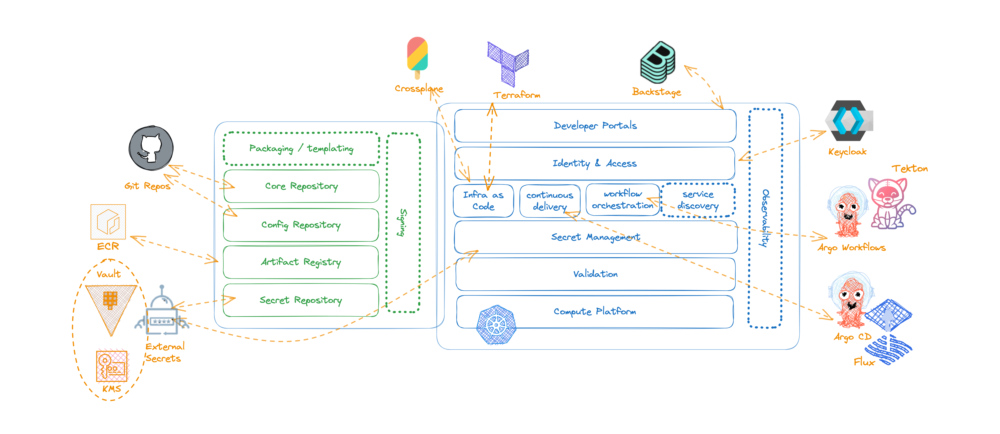

# Technology Choices

Every organization has slightly different requirements for their internal
developer platforms (IDPs) and as such designing an all inclusive solution for an IDP 
is neither reasonable nor possible.

:::tip
Despite the differences in IDPs, there are common tooling, patterns, and practices that
emerge across organizations.
:::

While there is common agreements in how to use different tools across existing
capabilities in IDPs, there is little to no references on how these tools can be
configured and combined together to deliver the desired platform engineering
practices efficiently.

The goal for CNOE is to capture and provide references for tools commonly used by
platform engineers to design their IDPs, the way these tools are configured, and
implementations for common patterns and practices that can be extended and used
across organizations.

CNOE by no means tries to be comprehensive, but instead it aims to collect
community driven patterns and best practices based on what is commonly deployed
in production.

For CNOE reference implementations we will provide configurations, patterns, and practices with the following
(growing) list of technologies.

| **Capability** | **Technologies** |
|-------------|--------------|
| Code Repository | Git |
| Config Repository | Git |
| Artifact Registry | Container Registries |
| Secret Repository | External Secrets (with Vault and KMS) |
|             |              |
| Validations | CNOE Validators |
| Secret Management | External Secrets |
| Infra as Code |Terraform, Crossplane |
| Continuous Delivery | Argo CD, Flux|
| Continuous Integrations | Argo Workflows, Tekton |
| Identity & Access | KeyCloak |
| Developer Portals | Backstage |

