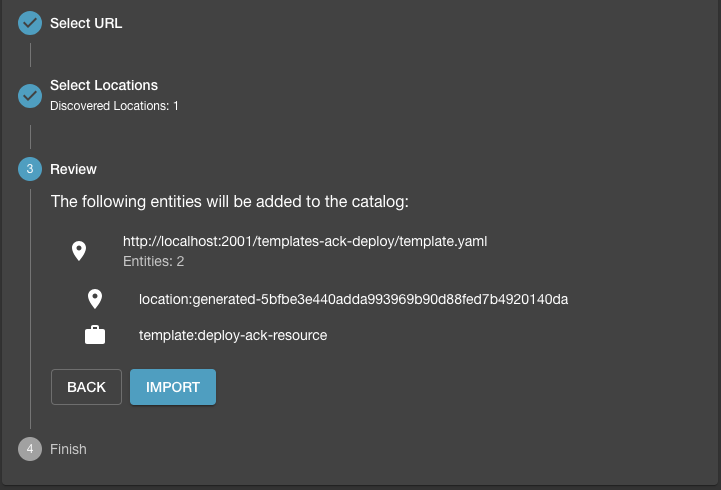
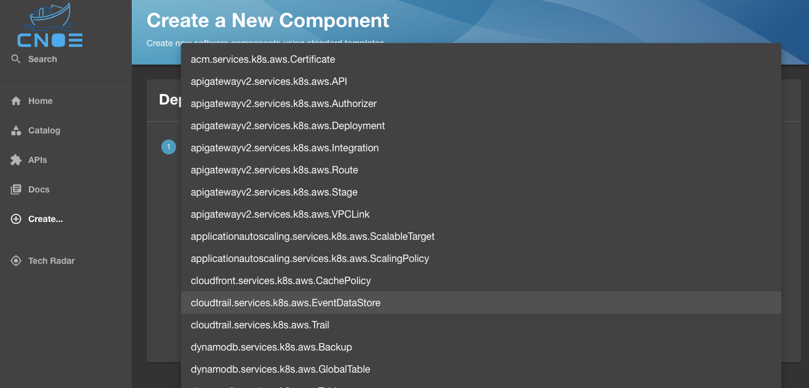
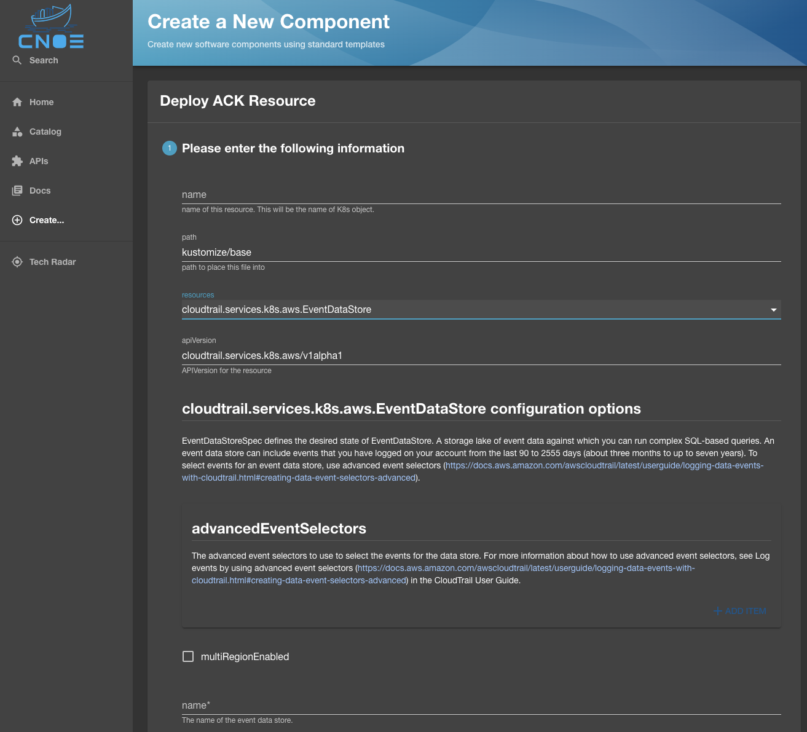

The CNOE CLI allows you to create Backstage developer workflows from existing Kubernetes
Custom Resource Definitions (CRDs) and Crossplane Composite Resource Definitions
(XRDs). 

:::tip
This is proven particularly useful for in-house Kubernetes controllers for which there
is a need for integration with Backstage.
:::

## Template Generation

As shown below, the `./cnoe template crd` command allows you to specify an input
directory for stored CRD specifications, the template that needs to be populated
with the list of converted CRDs, definings whether or not the
CRD is cluster-scoped or namespace-scoped, and configuration knobs to set the
name, title, and description of the generated template.

The generated templates are stored in the defined output directory.

```
Generate backstage templates from supplied CRD and XRD definitions

Usage:
  cnoe template crd [flags]

Flags:
  -h, --help                         help for crd
  -n, --namespaced                   whether or not resources are namespaced
      --templateDescription string   sets the description of the template
      --templateName string          sets the name of the template
  -t, --templatePath string          path to the template to be augmented with backstage info (default "scaffolding/template.yaml")
      --templateTitle string         sets the title of the template
  -v, --verifier stringArray         list of verifiers to test the resource against

Global Flags:
  -i, --inputDir string    input directory for CRDs and XRDs to be templatized
  -o, --outputDir string   output directory for backstage templates to be stored in
```

## Example

You require the list of CRDs that you want to convert, and a Backstage template:

### Custom Resource Definitions

For this example, let us look at the CRDs available in the [CNOE CLI repository](https://github.com/cnoe-io/cnoe-cli/tree/main/examples).
In particular, the CRDs for [Amazon Controllers for
Kubernetes (ACK)](https://github.com/aws-controllers-k8s). 
There is approximately 120 sample ACK CRDs in the [example repo](https://github.com/cnoe-io/cnoe-cli/tree/main/examples/ack-crds).

### The Backstage Scaffolding Template

You can choose a scaffolding template of your choice to pass to the tool for it
to augment it with the list of converted CRD elements. For this example we
choose the
[k8s-apply-template](https://github.com/cnoe-io/cnoe-cli/blob/main/config/templates/k8s-apply-template.yaml)
available in the CNOE CLI repository.

```yaml
apiVersion: scaffolder.backstage.io/v1beta3
kind: Template
metadata:
  name: deploy-resources
  title: Deploy Resources
  description: Deploy Resource to Kubernetes
spec:
  owner: guest
  type: service
  # these are the steps which are rendered in the frontend with the form input
  parameters:
    - title: Choose AWS Resources
      description: Select a AWS resource to add to your repository.
      properties:
        path:
          type: string
          description: path to place this file into
          default: kustomize/base
        name:
          type: string
          description: name of this resource. This will be the name of K8s object.
      required:
        - awsResources
        - name
  steps:
  - id: serialize
    name: serialize
    action: roadiehq:utils:serialize:yaml
    input:
      data:
        apiVersion: ${{ parameters.apiVersion }}
        kind: ${{ parameters.kind }}
        metadata:
          name: ${{ parameters.name }}
          namespace: ${{ parameters.namespace }}
        spec: ${{ parameters.config }}
  - id: sanitize
    name: sanitize
    action: cnoe:utils:sanitize
    input:
      document: ${{ steps['serialize'].output.serialized }}
  - id: apply
    name: apply-manifest
    action: cnoe:kubernetes:apply
    input:
      namespaced: true
      manifest: ${{ steps['sanitize'].output.sanitized }}
```

`metadata` and `spec.parameters` elements are placeholders that will be
overwritten by the tool when doing the conversion. However, the `steps` remain
as the primary set of actions later on to be taken by Backstage to deploy the
generated templates.

The set of steps for the scaffolder are pretty self explanatory but stating the
obvious, the first two steps `serialize` and `sanitize` the yaml document corresponding
to the converted CRD, and the last step deploys the CRD to a target Kubernetes
cluster.

### Conversion

Run the command below:

```bash
❯ cd ~/cnoe-cli
❯ ./cnoe template crd \
  --inputDir examples/ack-crds \
  --outputDir /tmp/templates-ack-deploy \
  --templatePath config/templates/k8s-apply-template.yaml \
  --namespaced \
  --templateName deploy-ack-resource \
  --templateTitle "Deploy ACK Resource" \
  --templateDescription "Deploy ACK Resource to Kubernetes"
```

The output in the `/tmp/templates-ack-deploy` should look like below:

```bash
drwxr-xr-x  119 user  wheel   3.7K Aug  7 23:26 resources
drwxr-xr-x    4 user  wheel   128B Aug  7 23:26 .
-rw-r--r--    1 user  wheel    15K Aug  8 19:25 template.yaml
drwxrwxrwt   68 root  wheel   2.1K Aug  8 19:34 ..
```

With the template augmented to have all the resoruces:

```yaml
redepiVersion: scaffolder.backstage.io/v1beta3
kind: Template
metadata:
  name: deploy-ack-resource
  title: Deploy ACK Resource
  description: Deploy Resource to Kubernetes
spec:
  owner: guest
  type: service
  parameters:
  - properties:
      name:
        description: name of this resource. This will be the name of K8s object.
        type: string
      path:
        default: kustomize/base
        description: path to place this file into
        type: string
      resources:
        type: string
        enum:
        - acm.services.k8s.aws.Certificate
        - apigatewayv2.services.k8s.aws.API
        - apigatewayv2.services.k8s.aws.Authorizer
        - apigatewayv2.services.k8s.aws.Deployment
        - apigatewayv2.services.k8s.aws.Integration
        - apigatewayv2.services.k8s.aws.Route
        - apigatewayv2.services.k8s.aws.Stage
        - apigatewayv2.services.k8s.aws.VPCLink
        - applicationautoscaling.services.k8s.aws.ScalableTarget
        - applicationautoscaling.services.k8s.aws.ScalingPolicy
        - cloudfront.services.k8s.aws.CachePolicy
        - cloudtrail.services.k8s.aws.EventDataStore
        - cloudtrail.services.k8s.aws.Trail
        ...
    dependencies:
      resources:
        oneOf:
        - $yaml: resources/acm.services.k8s.aws.certificate.yaml
        - $yaml: resources/apigatewayv2.services.k8s.aws.api.yaml
        - $yaml: resources/apigatewayv2.services.k8s.aws.authorizer.yaml
        - $yaml: resources/apigatewayv2.services.k8s.aws.deployment.yaml
        - $yaml: resources/apigatewayv2.services.k8s.aws.integration.yaml
        - $yaml: resources/apigatewayv2.services.k8s.aws.route.yaml
        - $yaml: resources/apigatewayv2.services.k8s.aws.stage.yaml
        - $yaml: resources/apigatewayv2.services.k8s.aws.vpclink.yaml
        - $yaml: resources/applicationautoscaling.services.k8s.aws.scalabletarget.yaml
        - $yaml: resources/applicationautoscaling.services.k8s.aws.scalingpolicy.yaml
        - $yaml: resources/cloudfront.services.k8s.aws.cachepolicy.yaml
        - $yaml: resources/cloudtrail.services.k8s.aws.eventdatastore.yaml
        - $yaml: resources/cloudtrail.services.k8s.aws.trail.yaml
        ...
  steps:
  - id: serialize
    name: serialize
    action: roadiehq:utils:serialize:yaml
    input:
      data:
        apiVersion: ${{ parameters.apiVersion }}
        kind: ${{ parameters.kind }}
        metadata:
          name: ${{ parameters.name }}
          namespace: ${{ parameters.namespace }}
        spec: ${{ parameters.config }}
  - id: sanitize
    name: sanitize
    action: cnoe:utils:sanitize
    input:
      document: ${{ steps['serialize'].output.serialized }}
  - id: apply
    name: apply-manifest
    action: cnoe:kubernetes:apply
    input:
      manifest: ${{ steps['sanitize'].output.sanitized }}
      namespaced: true

```

### Importing to Backstage

The generated template can then registered with Backstage by pushing it to a
repository and analyzing the generated content.  With a valid template, 
the analysis would be successfully validated and you can import the template
into Backstage.



It would show up in the list of available templates (in this case the service
template to "Deploy ACK Resources"):


Choosing the template would load all the resources dynamically generated for the
template. In case of Amazon Controller for Kubernetes (ACK), it will be the list 
of over 180 resources that we created from the available CRDs.



Once the desired resource is selected, the Backstage UI will be populated with
the list of all properties that can be configured for this CRD, with the
Backstage template validating the presence of required properties before you can
proceed:



Once the properties are defined, the resource is hydrated for deployment to
Kubernetes:


Where deploying the resource will result in running the Backstage scaffolder and
getting the resource deployed to a target cluster as configured in your
template:


