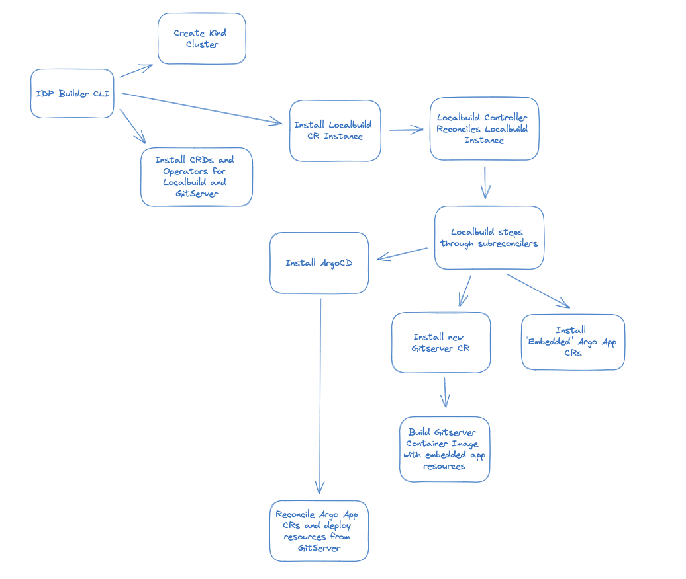
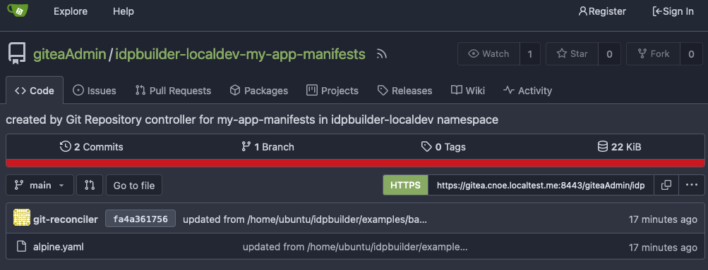
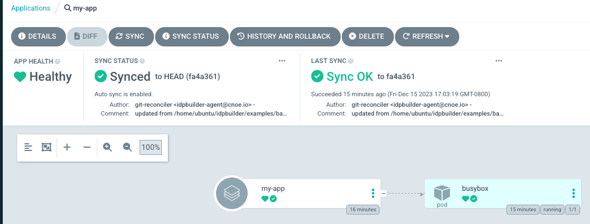

:::tip stay up-to-date

Find the latest on the idpBuilder here: [cnoe-io/idpbuilder](https://github.com/cnoe-io/idpbuilder)
:::

idpbuilder is made of two phases: CLI and Kubernetes controllers.



### CLI

When the idpbuilder binary is executed, it starts with the CLI phase.

1. This is the phase where command flags are parsed and translated into relevant Go structs' fields. Most notably the [`LocalBuild`](https://github.com/cnoe-io/idpbuilder/blob/main/api/v1alpha1/localbuild_types.go) struct.
2. Create a Kind cluster, then update the kubeconfig file.
3. Once the kind cluster is started and relevant fields are populated, Kubernetes controllers are started:
  *  `LocalbuildReconciler` responsible for bootstrapping the cluster with absolute necessary packages. Creates Custom Resources (CRs) and installs embedded manifests.
  *  `RepositoryReconciler` responsible for creating and managing Gitea repository and repository contents.
  *  `CustomPackageReconciler` responsible for managing custom packages.
4. They are all managed by a single Kubernetes controller manager.
5. Once controllers are started, CRs corresponding to these controllers are created. For example for Backstage, it creates a GitRepository CR and ArgoCD Application.
6. CLI then waits for these CRs to be ready.

### Custom Packages

Idpbuilder supports specifying custom packages using the flag `--package-dir` flag. This flag expects a directory containing ArgoCD application files.

Let's take a look at [this example](examples/basic). This example defines two custom package directories to deploy to the cluster.

To deploy these packages, run the following commands from this repository's root.

```
./idpbuilder create --package-dir examples/basic/package1  --package-dir examples/basic/package2
```

Running this command should create three additional ArgoCD applications in your cluster.

```sh
$ kubectl get Applications -n argocd  -l example=basic
NAME         SYNC STATUS   HEALTH STATUS
guestbook    Synced        Healthy
guestbook2   Synced        Healthy
my-app       Synced        Healthy
```

Let's break this down. The [first package directory](examples/basic/package1) defines an application. This corresponds to the `my-app` application above. In this application, we want to deploy manifests from local machine in GitOps way.

The directory contains an [ArgoCD application file](examples/basic/package1/app.yaml). This is a normal ArgoCD application file except for one field.

```yaml
apiVersion: argoproj.io/v1alpha1
kind: Application
spec:
  source:
    repoURL: cnoe://manifests
```

The `cnoe://` prefix in the `repoURL` field indicates that we want to sync from a local directory.
Values after `cnoe://` is treated as a relative path from this file. In this example, we are instructing idpbuilder to make ArgoCD sync from files in the [manifests directory](examples/basic/package1/manifests).

As a result the following actions were taken by idpbuilder: 
1. Create a Gitea repository.
2. Fill the repository with contents from the manifests directory.
3. Update the Application spec to use the newly created repository.

You can verify this by going to this address in your browser: https://gitea.cnoe.localtest.me:8443/giteaAdmin/idpbuilder-localdev-my-app-manifests




This is the repository that corresponds to the [manifests](examples/basic/package1/manifests) folder.
It contains a file called `alpine.yaml`, synced from the `manifests` directory above.

You can also view the updated Application spec by going to this address: https://argocd.cnoe.localtest.me:8443/applications/argocd/my-app




The second package directory defines two normal ArgoCD applications referencing a remote repository.
They are applied as-is.

### Controllers

During this phase, controllers act on CRs created by the CLI phase. Resources such as Gitea repositories and ArgoCD applications are created. 

#### LocalbuildReconciler

`LocalbuildReconciler` bootstraps the cluster using embedded manifests. Embedded manifests are yaml files that are baked into the binary at compile time.
1. Install core packages. They are essential services that are needed for the user experiences we want to enable:
  * Gitea. This is the in-cluster Git server that hosts Git repositories.
  * Ingress-nginx. This is necessary to expose services inside the cluster to the users.
  * ArgoCD. This is used as the packaging mechanism. Its primary purpose is to deploy manifests from gitea repositories.
2. Once they are installed, it creates `GitRepository` CRs for core packages. This CR represents the git repository on the Gitea server.
3. Create ArgoCD applications for the apps. Point them to the Gitea repositories. From here on, ArgoCD manages the core packages.

Once core packages are installed, it creates the other embedded applications: Backstage and Crossplane.
1. Create `GitRepository` CRs for the apps.
2. Create ArgoCD applications for the apps. Point them to the Gitea repositories.

#### RepositoryReconciler

`RepositoryReconciler` creates Gitea repositories.
The content of the repositories can either be sourced from Embedded file system or local file system.

#### CustomPackageReconciler

`CustomPackageReconciler` parses the specified ArgoCD application files. If they specify repository URL with the scheme `cnoe://`,
it creates `GitRepository` CR with source specified as local, then creates ArgoCD application with the repository URL replaced.

For example, if an ArgoCD application is specified as the following.

```yaml
apiVersion: argoproj.io/v1alpha1
kind: Application
spec:
  source:
    repoURL: cnoe://busybox
```

Then, the actual object created is this.

```yaml
apiVersion: argoproj.io/v1alpha1
kind: Application
spec:
  source:
    repoURL: http://my-gitea-http.gitea.svc.cluster.local:3000/giteaAdmin/idpbuilder-localdev-my-app-busybox.git
