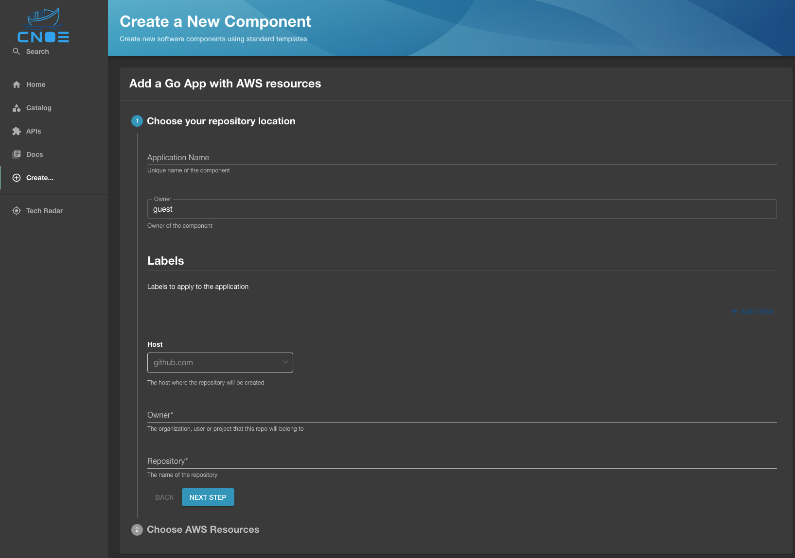
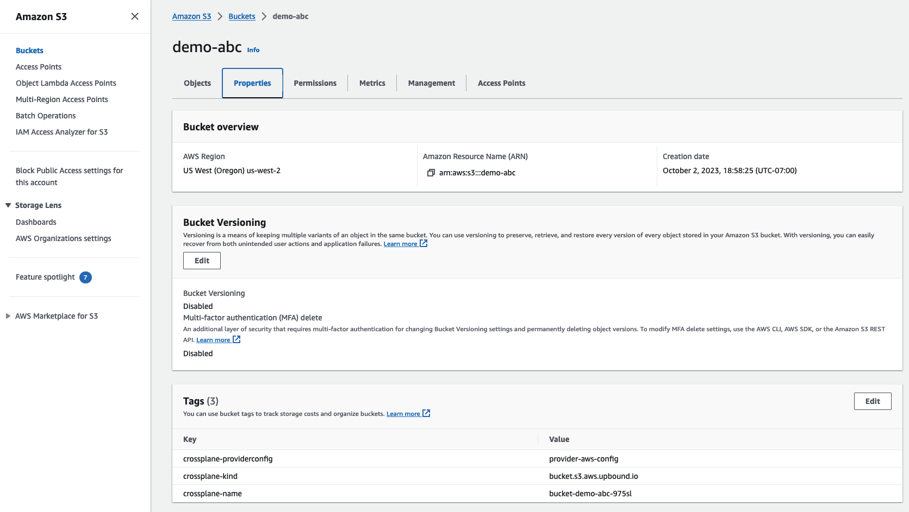

# Deploy an Example Application

In this document, we will walk you through the process of using the template generation capability with [Crossplane XRDs](https://docs.crossplane.io/master/concepts/composite-resource-definitions/) to deploy an example application with its AWS infrastructure dependencies.

## Template Generation

### Background

We start with a skeleton template [available here](https://github.com/awslabs/backstage-templates-on-eks/blob/main/crossplane/skeleton.yaml). 

This template has most everything you may need to bootstrap a new Go application. For example, the steps in the template creates a GitHub repository, creates some essential go files such as `go.mod` and `main.go`. The requirements for these files typically do not change from an application to application. Even though these files are common, applications themselves may need different supporting infrastructures such as DynamoDB table and S3 buckets.

We would like to give the template the ability to define and provision AWS resources as part of the application bootstrapping steps. To accomplish this, we will use Crossplane, ArgoCD, and Backstage scaffolding.

[Crossplane](https://www.crossplane.io/) is a CNCF project that allows you to define your own APIs from many different APIs using a mechanism called Compositions. Compositions allows you to define multiple interconnected API objects, then make it available for end users by exposing only a small subset of configuration options. For example,  you can create a composition that creates a Kubernetes service account and an IAM role just by specifying the name of the service account in a standard Kubernetes manifest. See [this link](https://docs.crossplane.io/) for more information.

[ArgoCD](https://argo-cd.readthedocs.io/en/stable/) is a GitOps solution that continuously syncs Kubernetes manifests into a target cluster.

### Generate

We will use the [Crossplane on EKS](https://github.com/awslabs/crossplane-on-eks) repository as the source of compositions and its schemas. Our goal is to import all compositions available into the skeleton template.

First, clone the repositories

```bash
git clone https://github.com/awslabs/crossplane-on-eks.git /tmp/crossplane-on-eks

git clone https://github.com/awslabs/backstage-templates-on-eks.git /tmp/backstage-templates-on-eks
```

Now we have everything we need to generate input fields in the template.

```bash
cd /tmp/backstage-templates-on-eks
mkdir demo
cnoe template crd -i /tmp/crossplane-on-eks/compositions/upbound-aws-provider/ \
  -t crossplane/skeleton.yaml -o demo  -c true
```

In the above command:

- Specified where the composition definition files live (`-i`)
- Specified the skeleton template file (`-t`)
- Specified the output directory (`-o`)
- Asked the CLI to put everything into one template (`-c`)

As a result of the command you should now have a new template file and a directory called `resources` containing other yaml files. 

```bash
ls -lh

total 32
drwxr-xr-x  15 staff  staff   480B Oct  2 16:24 resources
-rw-r--r--   1 staff  staff   4.4K Oct  2 19:34 template.yaml

ls -lh resources

total 320
-rw-r--r--  1 staff  staff   1.0K Oct  2 19:34 awsblueprints.io.encryptionkey.yaml
-rw-r--r--  1 staff  staff   1.5K Oct  2 19:34 awsblueprints.io.eventsourcemapping.yaml
-rw-r--r--  1 staff  staff   1.0K Oct  2 19:34 awsblueprints.io.fanout.yaml
-rw-r--r--  1 staff  staff   1.7K Oct  2 19:34 awsblueprints.io.firehoseapp.yaml
-rw-r--r--  1 staff  staff   1.4K Oct  2 19:34 awsblueprints.io.iampolicy.yaml
-rw-r--r--  1 staff  staff   1.7K Oct  2 19:34 awsblueprints.io.irsa.yaml
-rw-r--r--  1 staff  staff   1.4K Oct  2 19:34 awsblueprints.io.lambdafunction.yaml
-rw-r--r--  1 staff  staff   1.0K Oct  2 19:34 awsblueprints.io.notification.yaml
-rw-r--r--  1 staff  staff   1.4K Oct  2 19:34 awsblueprints.io.objectstorage.yaml
-rw-r--r--  1 staff  staff   1.0K Oct  2 19:34 awsblueprints.io.queue.yaml
-rw-r--r--  1 staff  staff   1.3K Oct  2 19:34 awsblueprints.io.serverlessapp.yaml
-rw-r--r--  1 staff  staff   8.4K Oct  2 19:34 awsblueprints.io.subscriptionfilter.yaml
-rw-r--r--  1 staff  staff   101K Oct  2 19:34 awsblueprints.io.xkinesisfirehose.yaml
```

The files in the resources directory are referenced in the main `template.yaml` file using the `$yaml` [special YAML parser key](https://backstage.io/docs/features/software-catalog/descriptor-format/#substitutions-in-the-descriptor-format) that Backstage supports.

```yaml
- $yaml: resources/awsblueprints.io.subscriptionfilter.yaml
```

This particular line tells Backstage to include the file available at `resources/awsblueprints.io.subscriptionfilter.yaml`  when rendering this template in the UI.

You may also noticed it added more fields like this:

```yaml
    - dependencies:
        resources:
          oneOf:
            - $yaml: resources/awsblueprints.io.subscriptionfilter.yaml
            - $yaml: resources/awsblueprints.io.eventsourcemapping.yaml
      properties:
        name:
          description: name of this resource. This will be the name of K8s object.
          type: string
        resources:
          enum:
            - awsblueprints.io.subscriptionfilter
            - awsblueprints.io.eventsourcemapping
```

The `dependencies` and `resources.enum` fields are used to define dependencies and additional schemas based on user inputs. For example, if the end user selects `awsblueprints.io.eventsourcemapping` from the enum list, the contents of `resources/awsblueprints.io.eventsourcemapping.yaml` is rendered. If you'd like to learn more, checkout the [json schema react form documentation](https://rjsf-team.github.io/react-jsonschema-form/docs/).


### Provision Resources

Once the input fields are generated, it is ready to use. You can register it in your Backstage instance. The ready-to-use version of the template is [available here](https://github.com/awslabs/backstage-templates-on-eks/blob/main/crossplane/template.yaml) if you prefer.


#### ArgoCD
Before we continue, a little bit about the ArgoCD setup. In the reference implementation, ArgoCD is setup as follows:

1. A GitHub token is available for ArgoCD.
2. ArgoCD is configure to look for repositories in the specified organization with two conditions:
    - The GitHub repository name must start with `demo`
    - There must be a path available at `kustomize/dev`

    See [this file](https://github.com/cnoe-io/reference-implementation-aws/blob/main/setups/argocd/application-set.yaml) for more information.

To bridge the gap between Backstage and ArgoCD, what we want to do in Backstage is to create a repository named `demo-*`, then ensure `kustomize/dev` path exists. All these are handled in [the template steps](https://github.com/awslabs/backstage-templates-on-eks/blob/c94cb7f70410bc2a48523d78440f8a39630c0bc8/crossplane/template.yaml#L86-L123).


#### Backstage
When you open the template in Backstage, the template input fields will be rendered in Backstage like this:


For this example, let's use the `ObjectStorage` kind. The source for this composition is available [here](https://github.com/awslabs/crossplane-on-eks/tree/main/compositions/upbound-aws-provider/s3). In essence, this composition will:
1. Create a S3 bucket. 
2. Enable default Server Side Encryption for the bucket.
3. Block all public access.

To take advantage of this composition, you just have to create a yaml file like this:

```yaml
apiVersion: awsblueprints.io/v1alpha1
kind: ObjectStorage
metadata:
  name: test-bucket-awsblueprint-123456789
spec:
  resourceConfig:
    providerConfigName: aws-provider-config
    region: us-west-2
```

This yaml file is created in [these steps](https://github.com/awslabs/backstage-templates-on-eks/blob/c94cb7f70410bc2a48523d78440f8a39630c0bc8/crossplane/template.yaml#L102-L116) in the template.

Let's fill out the template form we just created. 



1. The application name must start with `demo-`
2. Set the owner to be your organization name. e.g. for `https://github.com/cnoe-io`, organization name should be `cnoe-io`.
3. The repository name need to match the application name. e.g. `demo-<replaceme>`
4. Click Next.


In the next page. 

1. Select `awsblueprints.io.objectstorage`
2. Set Deletion policy to `Delete`.
3. Name can be anything.
4. Provider Config Name needs to be `provider-aws-config`
5. Choose a correct region for your setup. E.g. `us-west-2`

Once you submit the task, a new repository with a single nginx deployment and composition claim file is created. After a few minutes, ArgoCD should pick it up. Log in to your ArgoCD instance, then click on the newly created application. It should look something like this:


As you can see, a single Kubernetes object of kind `ObjectStorage` created multiple object in Kubernetes. These objects corresponds to AWS API objects. If you open your AWS S3 console, you should have a new S3 bucket with configuration we discussed above.




### Final notes

In this example, we provisioned a S3 bucket, but you can provision any API resources as long as underlying controllers support it. For example, you can provision a DynamoDB table and a Vault secrets.

You do not need to use Crossplane to use this pattern. You can also use ACK or any other operators that work on CRDs.


## Clean up

1. Unregister the entity from Backstage.
2. Delete the newly created repository.
3. Wait for ArgoCD to delete resources. This is important because Kubernetes resources are now tied to an external entity.

