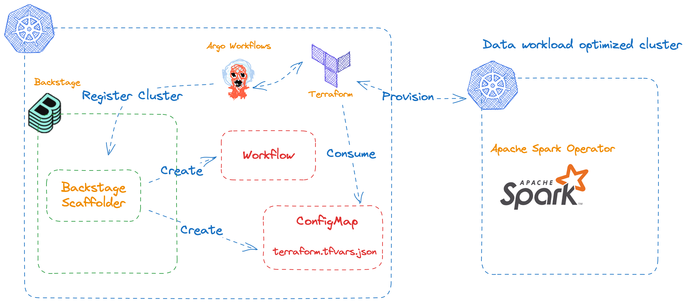
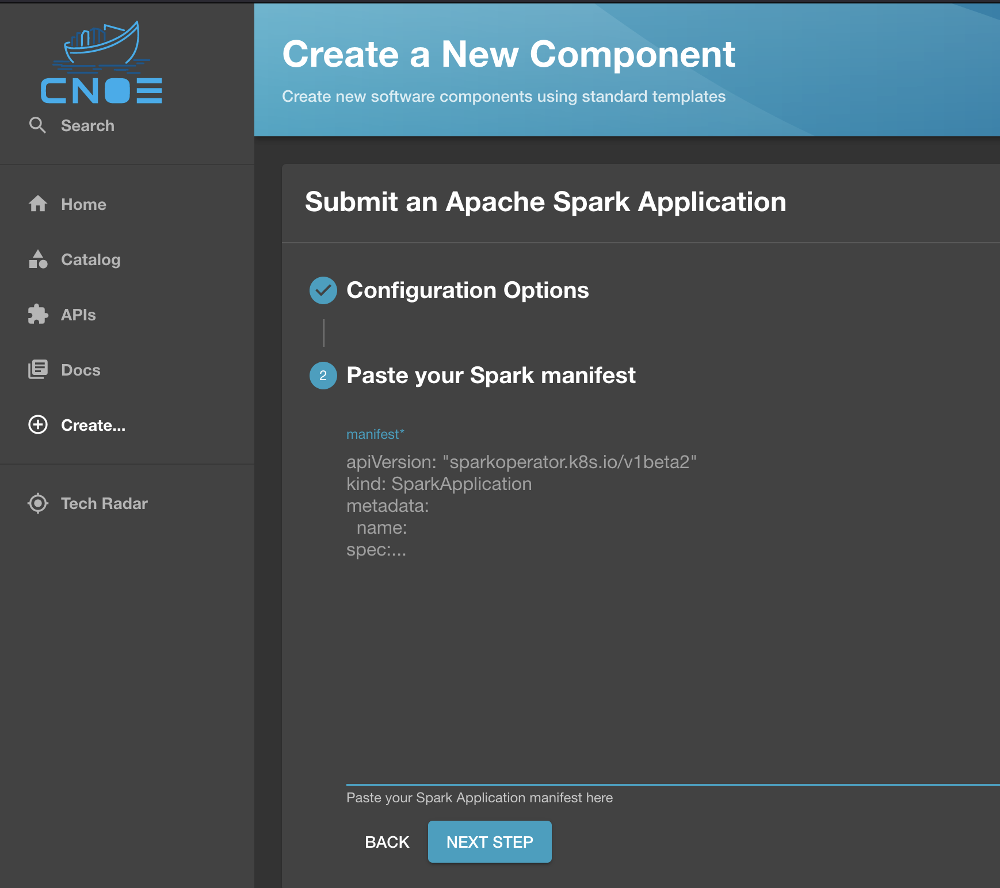

# Installation

See the Application IDP section for how to install it. This example extends the application IDP implementation.

# Data workload optimized EKS cluster

In this section we will walk through the process of provisioning and using data optimized EKS clusters available in the [Data on EKS repository](https://github.com/awslabs/data-on-eks). 

## Backstage template generation

Using the CNOE CLI, you can generate Backstage template input fields from Terraform modules, Kubernetes CRDs, and Crossplane XRDs.

For example, to generate input field from a terraform module in the Data on EKS repository: 

```bash
git clone https://github.com/awslabs/data-on-eks.git /tmp/data-on-eks

cnoe template tf -i /tmp/data-on-eks/analytics/terraform/spark-k8s-operator -o examples/template-generation -t examples/template-generation/data-on-eks.yaml -p '.spec.parameters[0].properties.tfVars

```
The above command takes the terraform module available at `/tmp/data-on-eks/analytics/terraform/spark-k8s-operator` then inserts generated backstage fields into a partially configured template at `examples/template-generation/data-on-eks.yaml`. This partially configure template contains fields that are common to all modules in the Data on EKS repository.

You can view what fields are generated by using `diff` and `yq`:

```bash
diff <(yq -P 'sort_keys(..)' -o=props examples/template-generation/spark-k8s-operator.yaml) <(yq -P 'sort_keys(..)' -o=props examples/template-generation/data-on-eks.yaml)
```

The rest of this document assumes you've used the spark-k8s-operator module to generate input fields.

## Terraform (imperative)

Once the template is hydrated, it is ready to use. You can push it to a private git repository within your organization or push it to a public repository. 
You can then register the template in the Backstage UI (`Create...` > `Register Existing Component`) or update your Backstage configuration. The main configuration file is a ConfigMap in the backstage namespace with the name `backstage-config`.

You can now use the template to create a EKS cluster with optimization for data workload using terraform. 


This example uses a custom Argo Workflows template to run the install script, add a IAM role to the admin group in the cluster, create a Backstage service account, then registers the cluster to Backstage for use. The template is installed during the bootstrap process. Let's break down the process.



During Backstage scaffolding, a Backstage entity is created. The template for it looks something like this. 

```yaml
apiVersion: backstage.io/v1alpha1
kind: Component
metadata:
  name: eks-cluster-${{values.name}}
  description: kubernetes cluster for ${{ values.name }}
  annotations:
    backstage.io/kubernetes-namespace: ${{values.namespace}}
    argo-workflows.cnoe.io/label-selector: env=dev,backstage-id=eks-cluster-${{values.name}}
    argo-workflows.cnoe.io/cluster-name: ${{values.clusterName}}
```

What is important here is the annotations field. The annotation values tell the Backstage Argo Workflows plugins how to find and display information related to this entity. In essence, annotations informs:
- Which cluster to look for Argo Workflows information. `argo-workflows.cnoe.io/cluster-name`
- What labels values should be used to look for Argo Workflow runs associated with this entity. `argo-workflows.cnoe.io/label-selector`
- In which namespace, are Argo Workflows run located? `backstage.io/kubernetes-namespace: ${{values.namespace}}`

Once this entity is created in Backstage, the Backstage scaffolder submits two manifests to the local cluster.

- ConfigMap. Contains `terraform.tfvars.json`.
- Argo Workflow.

The submitted ConfigMap manifest looks something like this.

```yaml
apiVersion: v1
kind: ConfigMap
metadata:
  name: "eks-cluster-${{values.name}}-tf-cm"
  namespace: "${{values.namespace}}"
data:
  terraform.tfvars.json: |
    ${{ values.tfVars | dump }}
```

The `values.tfVars | dump` bit tells Backstage Scaffolder to populate the field with values entered in the UI in the form of JSON. This manifest is responsible for passing user entered values to Terraform runtime because this ConfigMap will be mounted to the pod that runs Terraform. 

The Argo Workflows manifest looks like this.

```yaml
apiVersion: argoproj.io/v1alpha1
kind: Workflow
metadata:
  generateName: data-on-eks-
  namespace: ${{values.namespace}}
  labels:
    backstage-id: eks-cluster-${{values.name}}
    env: dev
spec:
  arguments:
    parameters:
      - name: backstage-entity-name
        value: eks-cluster-${{values.name}}
      - name: script-location
        value: analytics/terraform/spark-k8s-operator
      - name: admin-role
        value: ${{values.adminRoleName}}
  workflowTemplateRef:
    name: terraform-data-on-eks
```

From Backstage's perspective, the most relevant fields are in the metadata field: labels and namespace. They provide all the information necessary for Backstage to locate it in the cluster as discussed above.

As you can see above, we are creating a workflow from an existing workflow template named `terraform-data-on-eks`. This template is available under the `packages/argo-workflows-templates/base` path. It takes a few arguments as shown above.

- `backstage-entity-name` is obtained during scaffolding in Backstage. This corresponds to the name of entity created in Backstage. 

- As you may have noticed, the last two arguments are directly exposed in the Backstage Scaffolder UI and the values are passed to the template.

Once the workflow is submitted to the cluster, it will run the following tasks:

1. Pull the Data on EKS repository as a workflow artifact.
2. Copy the `terraform.tfvars.json` to the terraform module directory which is specified by the `script-location` argument.
3. Run the `install.sh` script. This is a wrapper script for terraform. This is common to all Data on EKS modules.
4. When the script completes or fails, the tf state file is compressed and stored as a secret in the cluster. 
5. Create an admin service account in the new cluster and get its token.
6. Store the token, EKS url, and CA data in Backstage compatible configuration format.
7. Assign the admin role in the new cluster to the IAM role specified in the `admin-role` argument.

You can monitor the progress of this within Backstage since the workflow run is associated with the Backstage entity. If you'd like to see detailed information about the run, you can click on it to go to the Argo Workflows UI.


### Submitting jobs

Once the new cluster is ready, you can submit a Spark Job to the new cluster through the Backstage template. The newly created cluster becomes available as a target to submit Apache Spark jobs in the UI.


To submit a job, use the `Submit an Apache Spark Application` template.



Once the task is submitted, the Backstage Scaffolder performs:
1. Update the submitted yaml file to ensure organizational requirements are met. In our case, we are adding required labels and updating the namespace.
2. Submit the yaml file to the target cluster.
3. Create a Backstage entity for this job. Note: This is likely to be necessary for the first time submitting a job. Subsequent submissions should use the same entity as long as the projects stays the same.

You can then monitor the progress of the job in Backstage UI. For example, you can see the actual manifest submitted to the cluster, the overall status, and live logs.


### Clean up

Once you are done with this demo, you can run the `terraform-data-on-eks-cleanup` Argo Workflow template to remove the cluster from your account and from Backstage.

## Terraform (declarative)

You can also use the terraform controller or Crossplane terraform provider to deploy terraform modules. Examples of this will be included in the future.


## Crossplane and ACK

When using Crossplane, the bulk of work is done by Crossplane providers. You can use GitOps tools like ArgoCD to deploy these manifests to the cluster using Backstage scaffolder templates. Examples of this will be included in the future.

