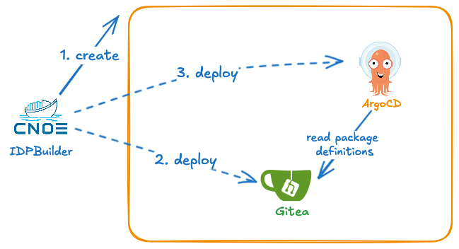

## Bootstrapping

When idpbuilder creates an environment for you, it performs the following tasks.

1. Create a local cluster if one does not exist yet.
1. Create a self-signed certificate, then set it as the default TLS certificate for ingress-nginx.
1. Configure CoreDNS to ensure names are resolved correctly.
1. Install Core Packages, then hands control over to ArgoCD.




## Self Signed Certificate

To ensure applications inside the cluster can talk to other services, idpbuilder creates a self-signed TLS certificate. The certificate is a wild card certificate 
for the domain name and any subdomains given by the `--host` flag. 
For example, if you use the default domain name `cnoe.localtest.me` the certificate is issued for `cnoe.localtest.me` and `*.cnoe.localtest.me`

This certificate is then used by ingress-nginx as [the default TLS certificate](https://kubernetes.github.io/ingress-nginx/user-guide/tls/#default-ssl-certificate_. This means you can override TLS certificate used at ingress level if desired.

The certificate is also [imported to ArgoCD](https://argo-cd.readthedocs.io/en/stable/operator-manual/declarative-setup/#repositories-using-self-signed-tls-certificates-or-are-signed-by-custom-ca) as one of trusted CAs. This is necessary to make sure ArgoCD can talk to Gitea services without disabling TLS.

Finally, the certificate is exposed as a secret named `idpbuilder-cert` in the default namespace. To retrieve it, run the following command:

```bash
kubectl get secret -n default idpbuilder-cert
```

## Networking

### Overview

With the default configuration on Docker on Linux, kind cluster is set up as follows:

1. A Docker container runs as the Kubernetes node and the container port 443 is exposed on host port 8443. You can confirm this by running `docker container ls`
1. Ingress-nginx service is configured as `NodePort` and listens on port 443. You can confirm with `kubectl get service -n ingress-nginx  ingress-nginx-controller`.

With this setup, HTTP traffic for `https://gitea.cnoe.localtest.me:8443` roughly looks like this.

1. Domain name resolves to the local loopback address.
1. A request is made to `127.0.0.1:8443` with host set as `gitea.cnoe.localtest.me:8443`.
1. The request is sent to the container port 443.
1. Ingress-nginx looks at SNI and the host header, then routes the traffic to the Gitea service.
1. Gitea receives the request then sends back a response.


### DNS

By default, idpbuilder uses the domain name `cnoe.localtest.me` as the base domain name to expose services such as ArgoCD and Gitea.
Most subdomains under `localtest.me` resolves to the [local loopback address](https://en.wikipedia.org/wiki/Localhost).
This allows us to have a consistent name that resolves to a known IP address without using the `localhost` name.
See [the localtest.me documentation site](https://readme.localtest.me/) for more information.

### In-cluster DNS Configuration

idpbuilder configures in-cluster DNS service (CoreDNS) to ensure domain names are resolved correctly.
The name given by the `--host` flag resolves to the ingress-nginx controller service address. 
This allows us to resolve the domain name inside and outside cluster to the same endpoint. 

As described above, the default domain name, `cnoe.localtest.me`, resolves to a local loopback address such as `127.0.0.1`. 
This works for accessing the ingress-nginx service from outside the cluster because the service port is exposed as NodePort on the local machine. 

This approach does not work for in-cluster traffic because the address resolves to local loopback interface. 
For example, if ArgoCD pod wants to access Gitea at `gitea.cnoe.localtest.me`, the address resolves to `127.0.0.1` which is the local loopback address within the node.
To ensure ArgoCD can talk to Gitea services, in-cluster DNS must be configured like so:

```
rewrite name gitea.cnoe.localtest.me ingress-nginx-controller.ingress-nginx.svc.cluster.local
```

This CoreDNS rewrite rule instructs CoreDNS to resolve requests made for `gitea.cnoe.localtest.me` using the address given by `ingress-nginx-controller.ingress-nginx.svc.cluster.local`


## Core Packages

idpbuilder installs the following packages to the cluster.

* **ArgoCD** is the GitOps solution to deploy manifests to Kubernetes clusters. In this project, a package is an ArgoCD application.
* **Gitea** server is the in-cluster Git server that ArgoCD can be configured to sync resources from. You can sync from local file systems to this.
* **Ingress-nginx** is used as a method to access in-cluster resources such as ArgoCD UI and Gitea UI.

Once installed, idpbuilder passes control over these packages to ArgoCD by storing manifests in Gitea repositories then creating ArgoCD applications. From here on, ArgoCD manages them based on manifests checked into Git repositories.

## Getting Relevant Secrets

The `idpbuilder get secrets` command retrieves the following:
- ArgoCD initial admin password.
- Gitea admin user credentials.
- Any secrets labeled with `cnoe.io/cli-secret=true`.

You can think of the command as executing the following kubectl commands:

  ```bash
  kubectl -n argocd get secret argocd-initial-admin-secret
  kubectl get secrets -n gitea gitea-admin-secret
  kubectl get secrets -A -l cnoe.io/cli-secret=true
  ```

If you want to retrieve secrets for a package, you can use the `-p` flag. To get secrets for a package named `gitea`: 

  ```bash
  idpbuilder get secrets -p gitea
  ```

For the `-p` flag to work, you must label the secret with `cnoe.io/package-name`. 
For example, to make secret values available in a secret named `my-secret` for a package named `foo`:

  ```bash
  kubectl label secret my-secret "cnoe.io/package-name=foo" "cnoe.io/cli-secret=true"
  ```

The secret will then be listed when issuing the `idpbuilder get secrets` command.
Alternatively, you can use the following command to retrieve the individual secret:

```
idpbuilder get secrets -p foo
```
