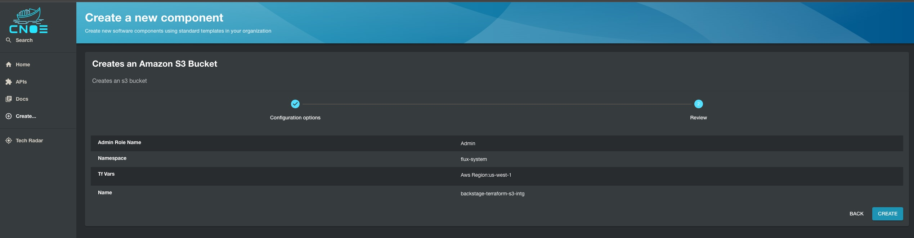

# Amazon S3 Bucket

This pattern demonstrates the creation of an Amazon S3 bucket in an AWS region. You can download the respective Backstage templates from the [s3 bucket](https://github.com/cnoe-io/backstage-terraform-integrations/tree/main/backstage-templates-for-eks/s3-bucket) folder under [cnoe-io/backstage-terraform-integrations](https://github.com/cnoe-io/backstage-terraform-integrations/).


## Prerequisite

You need to [add AWS credentials](https://github.com/tgpadua/backstage-terraform-integrations/tree/main?tab=readme-ov-file#deploy-idpbuilder-with-terraform-integration-templates) before deployed this pattern. 

## Deployment

Once you are done with setting up [backstage-terraform-integrations](https://github.com/cnoe-io/backstage-terraform-integrations), navigate to [Backstage](https://cnoe.localtest.me:8443/) and click on `create` in the left pane to view the list of available platform templates and click `Choose` on the **Creates an Amazon S3 Bucket** pattern as shown below:


Next, populate the terraform variables for the pattern deployment as shown below and click `Review`:


Next, validate the entered variables in the below confirmation screen and click `Create` :



Next, check on the steps of backstage template run as show below and click `Open In Catalog`:


Next, check on the below screen showing the created Backstage component and click `View Source` to navigate to the Gitea repository:


Next, check on the Gitea repo of the created component as shown below:


Next, Navigate to [ArgoCD](https://cnoe.localtest.me:8443/argocd) console and navigate to Argo App by name `backstage-terraform-s3-intg`to view the below screen:


## Validation

Next, lets validate the execution of the pattern by tofu controller. Run the below command on your terminal to check on `terraforms.infra.contrib.fluxcd.io ` resource:

```bash
> kubectl get terraforms.infra.contrib.fluxcd.io -A

NAMESPACE     NAME                                        READY     STATUS                       AGE
flux-system   aws-s3-bucket-backstage-terraform-s3-intg   Unknown   Reconciliation in progress   4m17s
```
Next, lets check on the Kubernetes pod in the `flux-system` namespace which executes the terraform code :

```bash
> kubectl get pods -n flux-system

NAME                                                  READY   STATUS        RESTARTS   AGE
aws-s3-bucket-backstage-terraform-s3-intg-tf-runner   1/1     Running       0          3m22s
notification-controller-5487f8c847-7w9dp              1/1     Running       0          17h
source-controller-69bcb7cd85-92nhv                    1/1     Running       0          17h
tf-controller-7f8c8bbdfc-8rmvq                        1/1     Running       0          17h

```

Lets wait for 5 mins for the `terraform apply` to be completed fully by the tofu controller and lets navigate to Amazon S3 console to view the created S3 bucket:


## Delete Workflow

Please follow the following steps if you are looking to delete `s3-bucket-backstage-terraform-s3-intg` component created using the backstage terraform integrations. The `Terraform` resources in this repo are configured to clean up the corresponding cloud resources. When the Argo CD application is deleted, the deletion hook for cloud resources kicks in (takes a little bit of time though).

1. In your [argocd](https://cnoe.localtest.me:8443/argocd) console, naviagate to `backstage-terraform-s3-intg` application created for your component and delete it manually.
1. In your [gitea](https://cnoe.localtest.me:8443/gitea/) console, navigate to the `backstage-terraform-s3-intg` repository for your component and delete it manually under settings.
1. Finally in your backstage console, navigate to `s3-bucket-backstage-terraform-s3-intg` component and click on `unregister component` to remove the deleted c
