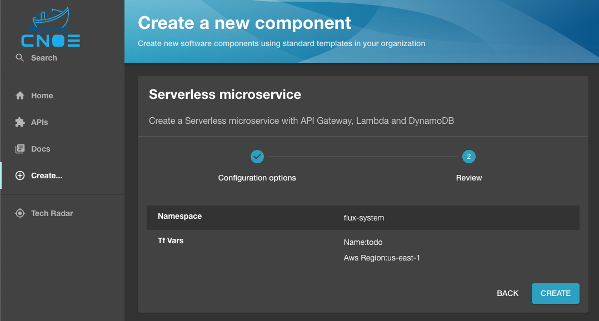

# Serverless Microservice

This pattern demonstrates a [Serverless Microservice](https://github.com/aws-samples/appmod-partners-serverless/tree/main/serverless-microservice) built using Amazon API Gateway, AWS Lambda, and Amazon DynamoDB. You can download the respective Backstage templates from the [serverless microservice](https://github.com/cnoe-io/backstage-terraform-integrations/tree/main/backstage-templates-for-eks/serverless-microservice) folder under [cnoe-io/backstage-terraform-integrations](https://github.com/cnoe-io/backstage-terraform-integrations/).

## Prerequisite

You need to [add AWS credentials](https://github.com/tgpadua/backstage-terraform-integrations/tree/main?tab=readme-ov-file#deploy-idpbuilder-with-terraform-integration-templates) before deployed this pattern. 

## Deployment

Navigate to [Backstage](https://cnoe.localtest.me:8443/), click on `Create` in the left pane to view the list of available platform templates, and click `Choose` on the **Serverless Microservice** pattern.

Next, populate the Terraform variables for the pattern deployment as shown below and click on `Review`.


Next, validate the entered variables in the below confirmation screen and click Create :



Next, check on the steps of backstage template run as show below and click `Open In Catalog`:


Next, check on the below screen showing the created Backstage component and click `View Source` to navigate to the Gitea repository:


Next, check on the Gitea repo of the created component as shown below:


Next, Navigate to [ArgoCD](https://cnoe.localtest.me:8443/argocd) console and navigate to Argo App by name `todo` view the below screen:


## Validation

Next, lets validate the execution of the pattern by tofu controller. Run the below command on your terminal to check on `terraforms.infra.contrib.fluxcd.io ` resource:

```bash
> kubectl get terraforms.infra.contrib.fluxcd.io -A

NAMESPACE     NAME                           READY   STATUS                                                         AGE
flux-system   serverless-microservice-todo   True    No drift: main@sha1:549d0d82efea3b6a46807578cf0a8583f35a799c   156m
```

Next, lets check on the Kubernetes pod in the `flux-system` namespace which executes the terraform controller:

```bash
> kubectl get pods -n flux-system

NAME                                       READY   STATUS    RESTARTS   AGE
notification-controller-5487f8c847-95p4m   1/1     Running   0          168m
source-controller-69bcb7cd85-st7ph         1/1     Running   0          168m
tf-controller-7f8c8bbdfc-c5xw7             1/1     Running   0          167m
```

Next, lets check on the logs of this `tf-controller-7f8c8bbdfc-c5xw7`as shown below:

```bash
> kubectl logs -n flux-system tf-controller-7f8c8bbdfc-c5xw7 |grep serverless-microservice-

{"level":"info","ts":"2024-08-06T21:22:22.008Z","msg":">> Started Generation: 1","controller":"terraform","controllerGroup":"infra.contrib.fluxcd.io","controllerKind":"Terraform","Terraform":{"name":"serverless-microservice-todo","namespace":"flux-system"},"namespace":"flux-system","name":"serverless-microservice-todo","reconcileID":"d440d7f5-9f77-475b-8f84-c509e318bd07","reconciliation-loop-id":"39c5d3d1-0551-468b-ad5b-4cc20fec86ca","start-time":"2024-08-06T21:22:22.007Z"}
{"level":"info","ts":"2024-08-06T21:22:22.050Z","msg":"getting source","controller":"terraform","controllerGroup":"infra.contrib.fluxcd.io","controllerKind":"Terraform","Terraform":{"name":"serverless-microservice-todo","namespace":"flux-system"},"namespace":"flux-system","name":"serverless-microservice-todo","reconcileID":"d440d7f5-9f77-475b-8f84-c509e318bd07","reconciliation-loop-id":"39c5d3d1-0551-468b-ad5b-4cc20fec86ca","start-time":"2024-08-06T21:22:22.007Z"}
{"level":"info","ts":"2024-08-06T21:22:22.050Z","msg":"before lookup runner: checking ready condition","controller":"terraform","controllerGroup":"infra.contrib.fluxcd.io","controllerKind":"Terraform","Terraform":{"name":"serverless-microservice-todo","namespace":"flux-system"},"namespace":"flux-system","name":"serverless-microservice-todo","reconcileID":"d440d7f5-9f77-475b-8f84-c509e318bd07","reconciliation-loop-id":"39c5d3d1-0551-468b-ad5b-4cc20fec86ca","start-time":"2024-08-06T21:22:22.007Z","ready":"nil"}
{"level":"info","ts":"2024-08-06T21:22:22.051Z","msg":"before lookup runner: updating status","controller":"terraform","controllerGroup":"infra.contrib.fluxcd.io","controllerKind":"Terraform","Terraform":{"name":"serverless-microservice-todo","namespace":"flux-system"},"namespace":"flux-system","name":"serverless-microservice-todo","reconcileID":"d440d7f5-9f77-475b-8f84-c509e318bd07","reconciliation-loop-id":"39c5d3d1-0551-468b-ad5b-4cc20fec86ca","start-time":"2024-08-06T21:22:22.007Z","ready":"nil"}
{"level":"info","ts":"2024-08-06T21:22:22.067Z","msg":"before lookup runner: updated status","controller":"terraform","controllerGroup":"infra.contrib.fluxcd.io","controllerKind":"Terraform","Terraform":{"name":"serverless-microservice-todo","namespace":"flux-system"},"namespace":"flux-system","name":"serverless-microservice-todo","reconcileID":"d440d7f5-9f77-475b-8f84-c509e318bd07","reconciliation-loop-id":"39c5d3d1-0551-468b-ad5b-4cc20fec86ca","start-time":"2024-08-06T21:22:22.007Z","ready":"nil"}
{"level":"info","ts":"2024-08-06T21:22:22.068Z","msg":"trigger namespace tls secret generation","controller":"terraform","controllerGroup":"infra.contrib.fluxcd.io","controllerKind":"Terraform","Terraform":{"name":"serverless-microservice-todo","namespace":"flux-system"},"namespace":"flux-system","name":"serverless-microservice-todo","reconcileID":"d440d7f5-9f77-475b-8f84-c509e318bd07","reconciliation-loop-id":"39c5d3d1-0551-468b-ad5b-4cc20fec86ca","start-time":"2024-08-06T21:22:22.007Z"}
{"level":"info","ts":"2024-08-06T21:22:22.810Z","msg":"show runner pod state: ","controller":"terraform","controllerGroup":"infra.contrib.fluxcd.io","controllerKind":"Terraform","Terraform":{"name":"serverless-microservice-todo","namespace":"flux-system"},"namespace":"flux-system","name":"serverless-microservice-todo","reconcileID":"d440d7f5-9f77-475b-8f84-c509e318bd07","reconciliation-loop-id":"39c5d3d1-0551-468b-ad5b-4cc20fec86ca","start-time":"2024-08-06T21:22:22.007Z","name":"serverless-microservice-todo","state":"not-found"}
{"level":"info","ts":"2024-08-06T21:22:37.895Z","msg":"runner is running","controller":"terraform","controllerGroup":"infra.contrib.fluxcd.io","controllerKind":"Terraform","Terraform":{"name":"serverless-microservice-todo","namespace":"flux-system"},"namespace":"flux-system","name":"serverless-microservice-todo","reconcileID":"d440d7f5-9f77-475b-8f84-c509e318bd07","reconciliation-loop-id":"39c5d3d1-0551-468b-ad5b-4cc20fec86ca","start-time":"2024-08-06T21:22:22.007Z"}
{"level":"info","ts":"2024-08-06T21:22:37.895Z","msg":"setting up terraform","controller":"terraform","controllerGroup":"infra.contrib.fluxcd.io","controllerKind":"Terraform","Terraform":{"name":"serverless-microservice-todo","namespace":"flux-system"},"namespace":"flux-system","name":"serverless-microservice-todo","reconcileID":"d440d7f5-9f77-475b-8f84-c509e318bd07","reconciliation-loop-id":"39c5d3d1-0551-468b-ad5b-4cc20fec86ca","start-time":"2024-08-06T21:22:22.007Z"}
{"level":"info","ts":"2024-08-06T21:22:37.949Z","msg":"write backend config: ok","controller":"terraform","controllerGroup":"infra.contrib.fluxcd.io","controllerKind":"Terraform","Terraform":{"name":"serverless-microservice-todo","namespace":"flux-system"},"namespace":"flux-system","name":"serverless-microservice-todo","reconcileID":"d440d7f5-9f77-475b-8f84-c509e318bd07","reconciliation-loop-id":"39c5d3d1-0551-468b-ad5b-4cc20fec86ca","start-time":"2024-08-06T21:22:22.007Z"}
{"level":"info","ts":"2024-08-06T21:22:37.951Z","msg":"new terraform","controller":"terraform","controllerGroup":"infra.contrib.fluxcd.io","controllerKind":"Terraform","Terraform":{"name":"serverless-microservice-todo","namespace":"flux-system"},"namespace":"flux-system","name":"serverless-microservice-todo","reconcileID":"d440d7f5-9f77-475b-8f84-c509e318bd07","reconciliation-loop-id":"39c5d3d1-0551-468b-ad5b-4cc20fec86ca","start-time":"2024-08-06T21:22:22.007Z","workingDir":"/tmp/flux-system-serverless-microservice-todo/serverless-microservice"}
{"level":"info","ts":"2024-08-06T21:22:37.961Z","msg":"generate vars from tf: ok","controller":"terraform","controllerGroup":"infra.contrib.fluxcd.io","controllerKind":"Terraform","Terraform":{"name":"serverless-microservice-todo","namespace":"flux-system"},"namespace":"flux-system","name":"serverless-microservice-todo","reconcileID":"d440d7f5-9f77-475b-8f84-c509e318bd07","reconciliation-loop-id":"39c5d3d1-0551-468b-ad5b-4cc20fec86ca","start-time":"2024-08-06T21:22:22.007Z"}
{"level":"info","ts":"2024-08-06T21:22:37.961Z","msg":"generated var files from spec","controller":"terraform","controllerGroup":"infra.contrib.fluxcd.io","controllerKind":"Terraform","Terraform":{"name":"serverless-microservice-todo","namespace":"flux-system"},"namespace":"flux-system","name":"serverless-microservice-todo","reconcileID":"d440d7f5-9f77-475b-8f84-c509e318bd07","reconciliation-loop-id":"39c5d3d1-0551-468b-ad5b-4cc20fec86ca","start-time":"2024-08-06T21:22:22.007Z"}
{"level":"info","ts":"2024-08-06T21:22:37.961Z","msg":"generate template: ok","controller":"terraform","controllerGroup":"infra.contrib.fluxcd.io","controllerKind":"Terraform","Terraform":{"name":"serverless-microservice-todo","namespace":"flux-system"},"namespace":"flux-system","name":"serverless-microservice-todo","reconcileID":"d440d7f5-9f77-475b-8f84-c509e318bd07","reconciliation-loop-id":"39c5d3d1-0551-468b-ad5b-4cc20fec86ca","start-time":"2024-08-06T21:22:22.007Z"}
{"level":"info","ts":"2024-08-06T21:22:37.961Z","msg":"generated template","controller":"terraform","controllerGroup":"infra.contrib.fluxcd.io","controllerKind":"Terraform","Terraform":{"name":"serverless-microservice-todo","namespace":"flux-system"},"namespace":"flux-system","name":"serverless-microservice-todo","reconcileID":"d440d7f5-9f77-475b-8f84-c509e318bd07","reconciliation-loop-id":"39c5d3d1-0551-468b-ad5b-4cc20fec86ca","start-time":"2024-08-06T21:22:22.007Z"}
{"level":"info","ts":"2024-08-06T21:22:44.907Z","msg":"init reply: ok","controller":"terraform","controllerGroup":"infra.contrib.fluxcd.io","controllerKind":"Terraform","Terraform":{"name":"serverless-microservice-todo","namespace":"flux-system"},"namespace":"flux-system","name":"serverless-microservice-todo","reconcileID":"d440d7f5-9f77-475b-8f84-c509e318bd07","reconciliation-loop-id":"39c5d3d1-0551-468b-ad5b-4cc20fec86ca","start-time":"2024-08-06T21:22:22.007Z"}
{"level":"info","ts":"2024-08-06T21:22:44.907Z","msg":"tfexec initialized terraform","controller":"terraform","controllerGroup":"infra.contrib.fluxcd.io","controllerKind":"Terraform","Terraform":{"name":"serverless-microservice-todo","namespace":"flux-system"},"namespace":"flux-system","name":"serverless-microservice-todo","reconcileID":"d440d7f5-9f77-475b-8f84-c509e318bd07","reconciliation-loop-id":"39c5d3d1-0551-468b-ad5b-4cc20fec86ca","start-time":"2024-08-06T21:22:22.007Z"}
{"level":"info","ts":"2024-08-06T21:22:44.911Z","msg":"workspace select reply: ok","controller":"terraform","controllerGroup":"infra.contrib.fluxcd.io","controllerKind":"Terraform","Terraform":{"name":"serverless-microservice-todo","namespace":"flux-system"},"namespace":"flux-system","name":"serverless-microservice-todo","reconcileID":"d440d7f5-9f77-475b-8f84-c509e318bd07","reconciliation-loop-id":"39c5d3d1-0551-468b-ad5b-4cc20fec86ca","start-time":"2024-08-06T21:22:22.007Z"}
{"level":"info","ts":"2024-08-06T21:22:44.911Z","msg":"calling plan ...","controller":"terraform","controllerGroup":"infra.contrib.fluxcd.io","controllerKind":"Terraform","Terraform":{"name":"serverless-microservice-todo","namespace":"flux-system"},"namespace":"flux-system","name":"serverless-microservice-todo","reconcileID":"d440d7f5-9f77-475b-8f84-c509e318bd07","reconciliation-loop-id":"39c5d3d1-0551-468b-ad5b-4cc20fec86ca","start-time":"2024-08-06T21:22:22.007Z"}
{"level":"info","ts":"2024-08-06T21:22:51.706Z","msg":"plan: ok, found drift: true","controller":"terraform","controllerGroup":"infra.contrib.fluxcd.io","controllerKind":"Terraform","Terraform":{"name":"serverless-microservice-todo","namespace":"flux-system"},"namespace":"flux-system","name":"serverless-microservice-todo","reconcileID":"d440d7f5-9f77-475b-8f84-c509e318bd07","reconciliation-loop-id":"39c5d3d1-0551-468b-ad5b-4cc20fec86ca","start-time":"2024-08-06T21:22:22.007Z"}
{"level":"info","ts":"2024-08-06T21:22:51.725Z","msg":"save tfplan: ok","controller":"terraform","controllerGroup":"infra.contrib.fluxcd.io","controllerKind":"Terraform","Terraform":{"name":"serverless-microservice-todo","namespace":"flux-system"},"namespace":"flux-system","name":"serverless-microservice-todo","reconcileID":"d440d7f5-9f77-475b-8f84-c509e318
````
Let's wait for 3 minutes for tofu controller to complete the `terraform apply` and navigate to API Gateway console and search for the API:


Then, copy the microservice endpoint from the `Invoke URL` property for testing:  


## Testing

Please refer to the [example requests](https://github.com/aws-samples/appmod-partners-serverless/tree/main/serverless-microservice#example-requests) to test the microservice.

## Clean up

To clean up all the resources created please follow these steps:

1. In your [Argo CD](https://cnoe.localtest.me:8443/argocd) console, navigate to the application created for your component and click on delete.
2. In your [Gitea](https://cnoe.localtest.me:8443/gitea/) console, navigate to the repository for your component and delete it manually under settings. 
3. Finally, in your [Backstage](https://cnoe.localtest.me:8443/) console, navigate to component created and click on `unregister component`.


