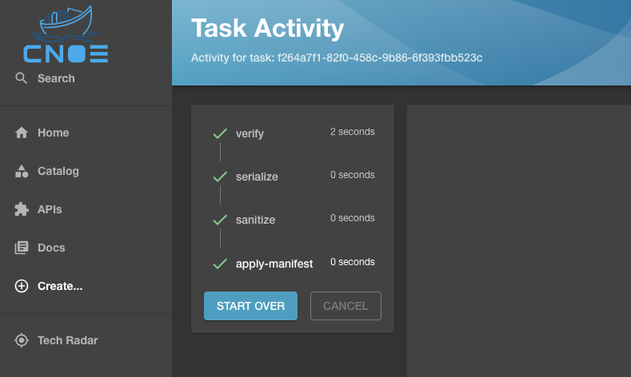

Verifications play a key role in ensuring successful rollouts in an IDP.
Verifications are done external to the target Kubernetes cluster and perform
readiness and dependency checks against the target cluster.

CNOE supports running verifications either by using the CNOE CLIE, or
by embedding them into the Backstage workflow as a `verify` step in the
[Scaffolder Backend Plugin](https://cnoe.io/docs/reference-implementation/plugins/scaffolder-backend).

CNOE supports the following (growing) list of verifications:
- availability of required CRDs in a target Kubernetes cluster
- readiness of operators in a target Kubernetes cluster

:::info
full specification for the verification templates is available in [the CNOE CLI
repo](https://github.com/cnoe-io/cnoe-cli/tree/main/config/templates). 
:::

## Writing a Verification Template

Below is a sample
spec for a prerequisite ensuring that the [Amazon Controllers for Kubernetes](https://aws-controllers-k8s.github.io/community/)
S3 controller is installed and running in a target cluster:

```yaml
apiVersion: cnoe.io/v1alpha1
kind: Prerequisite
metadata:
  name: ack-s3
  annotations:
  - test: something
  - another: something
spec:
  pods:
  - name: ack-release-s3
    namespace: ack-system
    state: Running
  crds:
  - group: s3.services.k8s.aws
    version: v1alpha1
    kind: Buckets
  - group: acme.cert-manager.io
    kind: Challenges
    version: v1
  - group: services.k8s.aws
    kind: AdoptedResources
    version: v1alpha1
  - group: services.k8s.aws
    kind: FieldExports
    version: v1alpha1
  - group: vpcresources.k8s.aws
    kind: SecurityGroupPolicies
    version: v1beta1
```

## Running Verifications

### via the CNOE CLI

The CLI support running verifications against a target cluster by running the
command `./cnoe k8s verify`:

```
❯ ./cnoe k8s verify -h
Verify if the required resources and controllers are working as expected

Usage:
  cnoe k8s verify [flags]

Flags:
  -c, --config stringArray   list of prerequisite configurations (samples under config/prereq)
  -h, --help                 help for verify

Global Flags:
  -k, --kubeconfig string   path to the kubeconfig file (default "~/.kube/config")
```

Below is an example successful output of running `verify` against a target cluster:

```
❯ ./cnoe k8s verify --config config/prereq/ack-s3-prerequisites.yaml
✓ ack-s3 - s3.services.k8s.aws/v1alpha1, Kind=Buckets
✓ ack-s3 - acme.cert-manager.io/v1, Kind=Challenges
✓ ack-s3 - services.k8s.aws/v1alpha1, Kind=AdoptedResources
✓ ack-s3 - services.k8s.aws/v1alpha1, Kind=FieldExports
✓ ack-s3 - vpcresources.k8s.aws/v1beta1, Kind=SecurityGroupPolicies
✓ ack-s3 - ack-system, Pod=ack-release-s3-chart-8f76bf8bb-nm9wv - Running
```

And when things fail:

```
❯ ./cnoe k8s verify --config config/prereq/bad-spark-prerequisites.yaml
X bad-spark - sparkoperator.k8s.io/v2beta2, Kind=SparkApplication
X bad-spark -  Pod=sprk-operator
2 errors occurred:
        * sparkoperator.k8s.io/v2beta2, Kind=SparkApplication not found
        *  Pod=sprk-operator not found
```

### via the Backend Scaffolder

:::caution
Running the verification phase from within CNOE is still experimental and
requires the presence of the CNOE CLI binary on the container image for
Backstage, where it is configured to target the desired cluster.
:::

The backend scaffolder plugin implements a step where the CNOE CLI can be called
with reference to the respective Prerequisite check that needs to be run against
the target cluster prior to installing resources.

In case of a S3 resource that is enabled via the Amazon Controllers for
Kubernetes (ACK), this would be a check that verifies the existence of the
relevant CRDs as well as ensuring that the ACK S3 Controller is present and
running.

In case of a failure, the Backstage scaffolder halts the execution flow and
shows the exact error reporting that the CNOE CLI reports upon execution from
within the terminal (see below):


In case of a successful verification, the verify step would finish execution
with an exit code 0 and allow for the rest of the steps to proceed:


