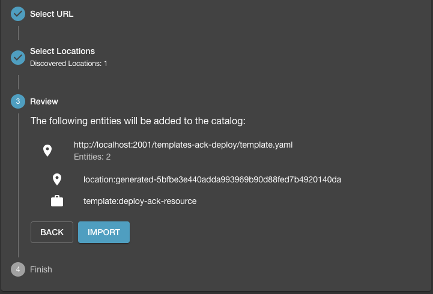
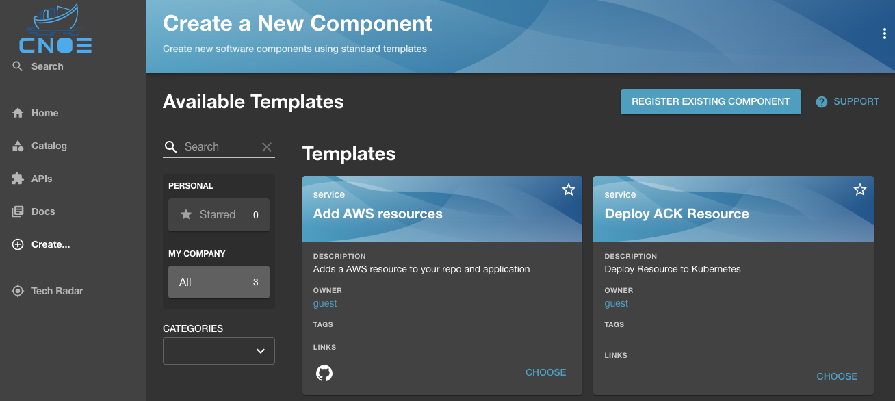
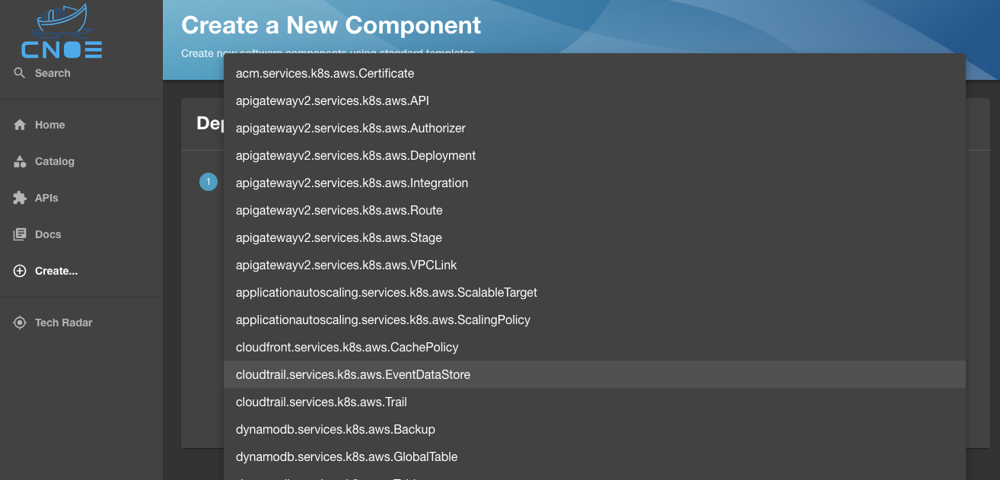
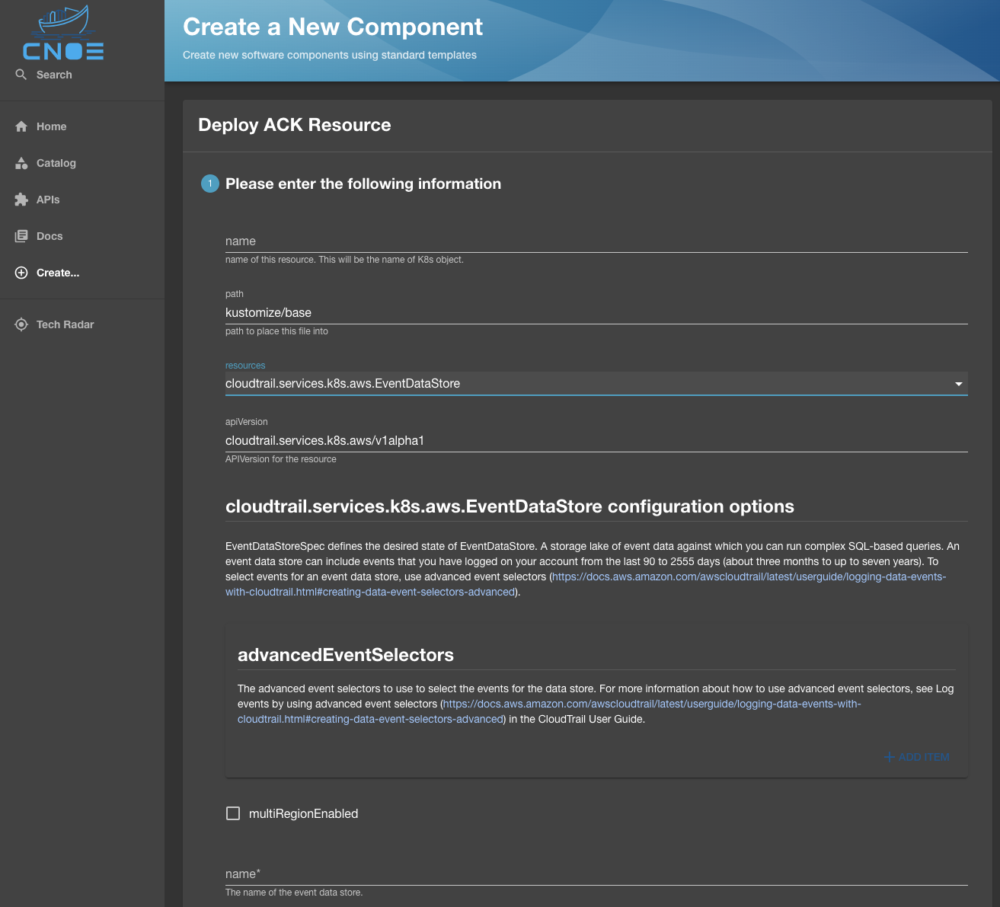
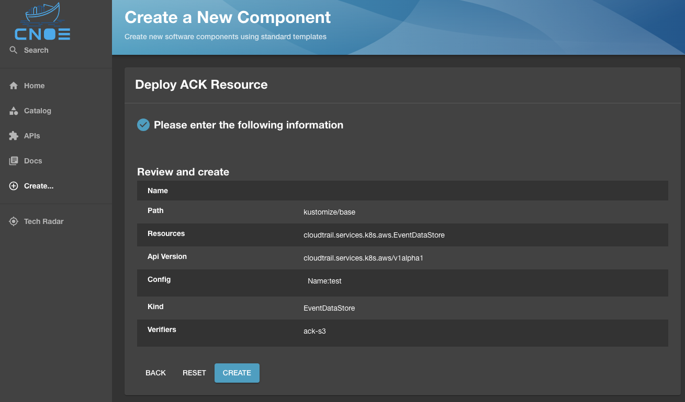
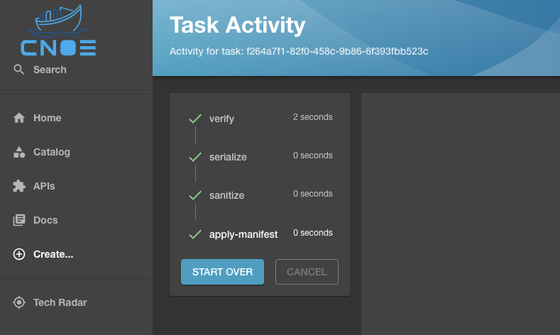
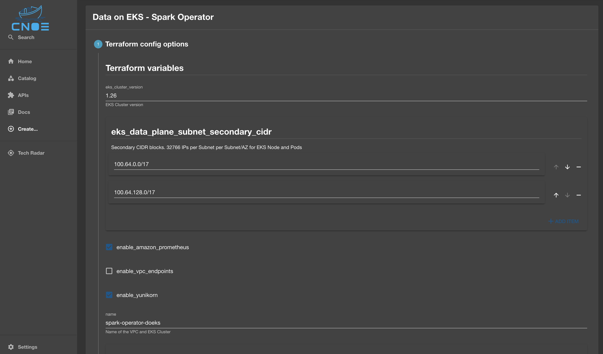
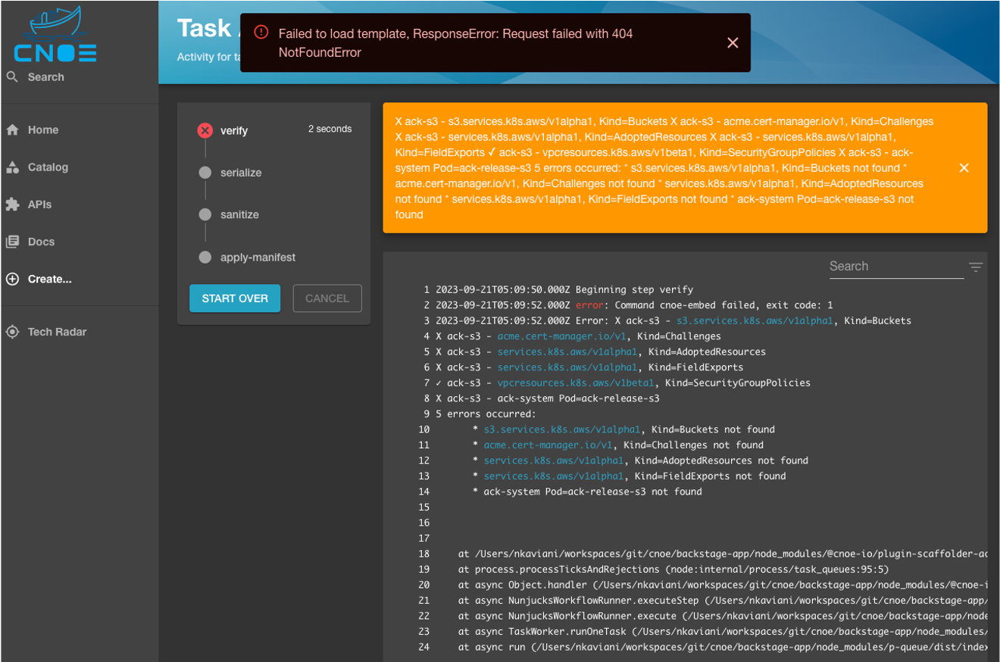

CNOE enhances your Backstage implementation by providing seamless integrations and tooling that help platform engineers and developers be more productive.

## Install CNOE CLI

The CNOE CLI is a powerful tool designed to enhance Internal Developer Platform (IDP) experiences by streamlining developer workflows through Kubernetes integration. It offers advanced templating capabilities that can automatically convert Kubernetes CRDs and Crossplane XRDs into Backstage templates, making it particularly valuable for organizations with custom Kubernetes controllers. The tool excels at transforming complex resources into user-friendly templates and supports bulk conversion with customizable parameters. By bridging the gap between developer workflows and underlying infrastructure, CNOE CLI helps organizations build cohesion in their development processes and simplify the migration of workflows to their developer portal, while adding necessary verifications and extensions.

Follow [cnoe-io/cnoe-cli](https://github.com/cnoe-io/cnoe-cli) documentation to install.

## Generate CNOE Backstage Template

You pick the option you want to use to generate the templates. Here we are demonstrating with two examples one using [CRD](#using-crdxrds) and other with [Terraform](#using-terraform).

### Using CRD/XRDs

As shown below, the `./cnoe template crd` command allows you to specify an input
directory for stored CRD specifications, the template that needs to be populated
with the list of converted CRDs, and configuration knobs to set the
name, title, and description of the generated template.

The generated templates are stored in the defined output directory.

```
Generate backstage templates from supplied CRD and XRD definitions

Usage:
  cnoe template crd [flags]

Flags:
  -h, --help                         help for crd
      --templateDescription string   sets the description of the template
      --templateName string          sets the name of the template
      --templateTitle string         sets the title of the template
  -v, --verifier stringArray         list of verifiers to test the resource against

Global Flags:
  -c, --collapse             if set to true, items are rendered and collapsed as drop down items in a single specified template
      --depth uint32          depth from given directory to search for TF modules or CRDs (default 2)
  -i, --inputDir string       input directory for CRDs and XRDs to be templatized
  -p, --insertAt string       jq path within the template to insert backstage info (default ".spec.parameters[0]")
  -o, --outputDir string      output directory for backstage templates to be stored in
      --raw templatePath      prints the raw open API output without putting it into a template (ignoring templatePath and `insertAt`)
  -t, --templatePath string   path to the template to be augmented with backstage info
```

In this example we will show how to generate Backstage template for ACK Controllers. You require the list of CRDs that you want to convert, and a Backstage template. For this example, let us look at the CRDs available in the [CNOE CLI repository](https://github.com/cnoe-io/cnoe-cli/tree/main/examples) in particular, the CRDs for [Amazon Controllers for Kubernetes (ACK)](https://github.com/aws-controllers-k8s). There is approximately 120 sample ACK CRDs in the [example repo](https://github.com/cnoe-io/cnoe-cli/tree/main/examples/ack-crds).

#### Step-1

First create the Backstage Scaffolding Template. You can choose a scaffolding template of your choice to pass to the tool for it to augment it with the list of converted CRD elements. For this example we choose the k8s-apply-template available in the CNOE CLI repository.

```yaml
apiVersion: scaffolder.backstage.io/v1beta3
kind: Template
metadata:
  name: deploy-resources
  title: Deploy Resources
  description: Deploy Resource to Kubernetes
spec:
  owner: guest
  type: service
  # these are the steps which are rendered in the frontend with the form input
  parameters:
    - title: Choose AWS Resources
      description: Select a AWS resource to add to your repository.
      properties:
        path:
          type: string
          description: path to place this file into
          default: kustomize/base
        name:
          type: string
          description: name of this resource. This will be the name of K8s object.
      required:
        - awsResources
        - name
  steps:
    - id: serialize
      name: serialize
      action: roadiehq:utils:serialize:yaml
      input:
        data:
          apiVersion: ${{ parameters.apiVersion }}
          kind: ${{ parameters.kind }}
          metadata:
            name: ${{ parameters.name }}
            namespace: ${{ parameters.namespace }}
          spec: ${{ parameters.config }}
    - id: sanitize
      name: sanitize
      action: cnoe:utils:sanitize
      input:
        document: ${{ steps['serialize'].output.serialized }}
    - id: apply
      name: apply-manifest
      action: cnoe:kubernetes:apply
      input:
        namespaced: true
        manifest: ${{ steps['sanitize'].output.sanitized }}
```

`metadata` and `spec.parameters` elements are placeholders that will be
overwritten by the tool when doing the conversion. However, the `steps` remain
as the primary set of actions later on to be taken by Backstage to deploy the
generated templates.

The set of steps for the scaffolder are pretty self explanatory but stating the
obvious, the first two steps `serialize` and `sanitize` the yaml document corresponding
to the converted CRD, and the last step deploys the CRD to a target Kubernetes
cluster.

#### Step-2

Run the command below to generate the template for ACK crds

```bash
$ cd ~/cnoe-cli
$ ./cnoe template crd \
  --inputDir examples/ack-crds \
  --outputDir /tmp/templates-ack-deploy \
  --templatePath config/templates/k8s-apply-template.yaml \
  --templateName deploy-ack-resource \
  --templateTitle "Deploy ACK Resource" \
  --templateDescription "Deploy ACK Resource to Kubernetes" \
  -c
```

The output in the `/tmp/templates-ack-deploy` should look like below:

```bash
drwxr-xr-x  119 user  wheel   3.7K Aug  7 23:26 resources
drwxr-xr-x    4 user  wheel   128B Aug  7 23:26 .
-rw-r--r--    1 user  wheel    15K Aug  8 19:25 template.yaml
drwxrwxrwt   68 root  wheel   2.1K Aug  8 19:34 ..
```

With the template augmented to have all the resources:

```yaml
redepiVersion: scaffolder.backstage.io/v1beta3
kind: Template
metadata:
  name: deploy-ack-resource
  title: Deploy ACK Resource
  description: Deploy Resource to Kubernetes
spec:
  owner: guest
  type: service
  parameters:
  - properties:
      name:
        description: name of this resource. This will be the name of K8s object.
        type: string
      path:
        default: kustomize/base
        description: path to place this file into
        type: string
      resources:
        type: string
        enum:
        - acm.services.k8s.aws.Certificate
        - apigatewayv2.services.k8s.aws.API
        - apigatewayv2.services.k8s.aws.Authorizer
        - apigatewayv2.services.k8s.aws.Deployment
        - apigatewayv2.services.k8s.aws.Integration
        - apigatewayv2.services.k8s.aws.Route
        - apigatewayv2.services.k8s.aws.Stage
        - apigatewayv2.services.k8s.aws.VPCLink
        - applicationautoscaling.services.k8s.aws.ScalableTarget
        - applicationautoscaling.services.k8s.aws.ScalingPolicy
        - cloudfront.services.k8s.aws.CachePolicy
        - cloudtrail.services.k8s.aws.EventDataStore
        - cloudtrail.services.k8s.aws.Trail
        ...
    dependencies:
      resources:
        oneOf:
        - $yaml: resources/acm.services.k8s.aws.certificate.yaml
        - $yaml: resources/apigatewayv2.services.k8s.aws.api.yaml
        - $yaml: resources/apigatewayv2.services.k8s.aws.authorizer.yaml
        - $yaml: resources/apigatewayv2.services.k8s.aws.deployment.yaml
        - $yaml: resources/apigatewayv2.services.k8s.aws.integration.yaml
        - $yaml: resources/apigatewayv2.services.k8s.aws.route.yaml
        - $yaml: resources/apigatewayv2.services.k8s.aws.stage.yaml
        - $yaml: resources/apigatewayv2.services.k8s.aws.vpclink.yaml
        - $yaml: resources/applicationautoscaling.services.k8s.aws.scalabletarget.yaml
        - $yaml: resources/applicationautoscaling.services.k8s.aws.scalingpolicy.yaml
        - $yaml: resources/cloudfront.services.k8s.aws.cachepolicy.yaml
        - $yaml: resources/cloudtrail.services.k8s.aws.eventdatastore.yaml
        - $yaml: resources/cloudtrail.services.k8s.aws.trail.yaml
        ...
  steps:
  - id: serialize
    name: serialize
    action: roadiehq:utils:serialize:yaml
    input:
      data:
        apiVersion: ${{ parameters.apiVersion }}
        kind: ${{ parameters.kind }}
        metadata:
          name: ${{ parameters.name }}
          namespace: ${{ parameters.namespace }}
        spec: ${{ parameters.config }}
  - id: sanitize
    name: sanitize
    action: cnoe:utils:sanitize
    input:
      document: ${{ steps['serialize'].output.serialized }}
  - id: apply
    name: apply-manifest
    action: cnoe:kubernetes:apply
    input:
      manifest: ${{ steps['sanitize'].output.sanitized }}
      namespaced: true

```

#### Step-3

In this step we will import the generated template to Backstage. The generated template is registered with Backstage by pushing it to a repository and analyzing the generated content. With a valid template, the analysis would be successfully validated and you can import the template into Backstage.



It would show up in the list of available templates (in this case the service
template to "Deploy ACK Resources"):



Choosing the template would load all the resources dynamically generated for the
template. In case of Amazon Controller for Kubernetes (ACK), it will be the list
of over 180 resources that we created from the available CRDs.



Once the desired resource is selected, the Backstage UI will be populated with
the list of all properties that can be configured for this CRD, with the
Backstage template validating the presence of required properties before you can
proceed:



Once the properties are defined, the resource is hydrated for deployment to
Kubernetes:



Where deploying the resource will result in running the Backstage scaffolder and
getting the resource deployed to a target cluster as configured in your
template:



### Using Terraform

The CNOE CLI supports integration of Terraform modules into the developer portal. 

#### Template Generation

To generate Backstage template input fields from Terraform modules, you can use the `tf` subcommand. Usage is shown below. 

```bash
Generate backstage templates by walking the given input directory, find TF modules,then create output file per module.
If the templatePath and insertionPoint flags are set, generated objects are merged into the given template at given insertion point.
Otherwise a yaml file with two keys are generated. The properties key contains the generated form input. The required key contains the TF variable names that do not have defaults.

Usage:
  cnoe template tf [flags]

Flags:
  -h, --help   help for tf

Global Flags:
  -c, --colllapse             if set to true, items are rendered and collapsed as drop down items in a single specified template
      --depth uint32          depth from given directory to search for TF modules or CRDs (default 2)
  -i, --inputDir string       input directory for CRDs and XRDs to be templatized
  -p, --insertAt string       jq path within the template to insert backstage info (default ".spec.parameters[0]")
  -o, --outputDir string      output directory for backstage templates to be stored in
      --raww templatePath     prints the raw open API output without putting it into a template (ignoring templatePath and `insertAt`)
  -t, --templatePath string   path to the template to be augmented with backstage info
```

#### Example

We can run the command against one of modules within the [Data on EKS](https://github.com/awslabs/data-on-eks) repository.

```bash
$ git clone https://github.com/awslabs/data-on-eks.git /tmp/data-on-eks

$ git clone https://github.com/cnoe-io/reference-implementation-aws.git /tmp/ref-impl

$ cnoe template tf \
  -i /tmp/data-on-eks/analytics/terraform/spark-k8s-operator \
  -t /tmp/ref-impl/examples/template-generation/data-on-eks.yaml \
  -p '.spec.parameters[0].properties.tfVars' \
  -o .
```

The `-i` flag specifies input Terraform module directory. In this example, the content looks like this: 

```bash
$ ls /tmp/data-on-eks/analytics/terraform/spark-k8s-operator
README.md              data.tf                karpenter-provisioners spark-team.tf
addons.tf              examples               main.tf                variables.tf
amp.tf                 helm-values            outputs.tf             versions.tf
cleanup.sh             install.sh             providers.tf           vpc.tf
```

The `-t` flag specifies the location of the partially configured template file. It may look something like this:

```yaml
apiVersion: scaffolder.backstage.io/v1beta3
kind: Template
spec:
  parameters:
    - title: Terraform config options
      properties:
        tfVars: # this field is to be generated.
          title: Terraform variables
          type: object
    - title: Configuration Options
      properties:
        name:
          title: name of this entry
          type: string
        namespace:
          title: namespace within the kubernetes cluster to deploy this
          type: string
          default: data-on-eks
        adminRoleName: 
          title: Admin Role Name
          description: Name of the role to give the administrative rights on the EKS cluster.
          default: Admin
          type: string
        clusterName:
          title: Cluster to run
          description: The cluster to run this workflow in. 
          type: string
          ui:field: KubernetesClusterPicker
        repoUrl: # need a place to store this entity information.
          title: Repository Location
          type: string
          ui:field: RepoUrlPicker
          ui:options:
            allowedHosts:
              - github.com
...
```
This template contains input fields (`.spec.parameters[1]`) that are common to all Data on EKS blueprints. For example, the name of the admin IAM role that will have Cluster Admin access is common to all EKS clusters. The only difference between templates are the terraform configuration options field. We will populate this field with variables from a terraform module.

The `-p` flag specifies where you want to insert input field within the given template. In this case, we want to insert it at `.spec.parameters[0].properties.tfVars`.

The `-o` flag specifies the output directory. In this case, we want it to output it to the current directory.

Once the fields are generated and inserted, the template is ready to use. When rendered in Backstage, it should look something like this. 




The diff between the original template and generated template should look something like this:

```bash
spec.parameters
  - one list entry removed:
    - title: "Terraform config options"
    │ properties:
    │ │ tfVars:
    │ │ │ type: object
    │ │ │ title: "Terraform variables"

  + one list entry added:
    - properties:
    │ │ tfVars:
    │ │ │ type: object
    │ │ │ title: "Terraform variables"
    │ │ │ properties:
    │ │ │ │ name:
    │ │ │ │ │ type: string
    │ │ │ │ │ default: spark-operator-doeks
    │ │ │ │ │ description: "Name of the VPC and EKS Cluster"
    │ │ │ │ eks_cluster_version:
    │ │ │ │ │ type: string
    │ │ │ │ │ default: 1.26
    │ │ │ │ │ description: "EKS Cluster version"
    │ │ │ │ enable_amazon_prometheus:
    │ │ │ │ │ type: boolean
    │ │ │ │ │ default: true
    │ │ │ │ │ description: "Enable AWS Managed Prometheus service"
    │ │ │ │ enable_vpc_endpoints:
    │ │ │ │ │ type: boolean
    │ │ │ │ │ default: false
    │ │ │ │ │ description: "Enable VPC Endpoints"
    │ │ │ │ enable_yunikorn:
    │ │ │ │ │ type: boolean
    │ │ │ │ │ default: true
    │ │ │ │ │ description: "Enable Apache YuniKorn Scheduler"
    │ │ │ │ region:
    │ │ │ │ │ type: string
    │ │ │ │ │ default: us-west-2
    │ │ │ │ │ description: Region
    │ │ │ │ vpc_cidr:
    │ │ │ │ │ type: string
    │ │ │ │ │ default: 10.1.0.0/16
    │ │ │ │ │ description: "VPC CIDR. This should be a valid private (RFC 1918) CIDR range"
    │ │ │ │ eks_data_plane_subnet_secondary_cidr:
    │ │ │ │ │ type: array
    │ │ │ │ │ description: "Secondary CIDR blocks. 32766 IPs per Subnet per Subnet/AZ for EKS Node and Pods"
    │ │ │ │ │ default:
    │ │ │ │ │ - 100.64.0.0/17
    │ │ │ │ │ - 100.64.128.0/17
    │ │ │ │ │ items:
    │ │ │ │ │ │ type: string
    │ │ │ │ private_subnets:
    │ │ │ │ │ type: array
    │ │ │ │ │ description: "Private Subnets CIDRs. 254 IPs per Subnet/AZ for Private NAT + NLB + Airflow + EC2 Jumphost etc."
    │ │ │ │ │ default:
    │ │ │ │ │ - 10.1.1.0/24
    │ │ │ │ │ - 10.1.2.0/24
    │ │ │ │ │ items:
    │ │ │ │ │ │ type: string
    │ │ │ │ public_subnets:
    │ │ │ │ │ type: array
    │ │ │ │ │ description: "Public Subnets CIDRs. 62 IPs per Subnet/AZ"
    │ │ │ │ │ default:
    │ │ │ │ │ - 10.1.0.0/26
    │ │ │ │ │ - 10.1.0.64/26
    │ │ │ │ │ items:
    │ │ │ │ │ │ type: string
    │ │ │ │ secondary_cidr_blocks:
    │ │ │ │ │ type: array
    │ │ │ │ │ description: "Secondary CIDR blocks to be attached to VPC"
    │ │ │ │ │ default:
    │ │ │ │ │ - 100.64.0.0/16
    │ │ │ │ │ items:
    │ │ │ │ │ │ type: string
    │ title: "Terraform config options"
```

## Verification

Verifications play a key role in ensuring successful rollouts in an IDP.
Verifications are done external to the target Kubernetes cluster and perform
readiness and dependency checks against the target cluster.

CNOE supports running verifications either by using the CNOE cli, or
by embedding them into the Backstage workflow as a `verify` step in the
[Scaffolder Backend Plugin](https://cnoe.io/docs/reference-implementation/plugins/scaffolder-backend).

CNOE supports the following (growing) list of verifications:
- availability of required CRDs in a target Kubernetes cluster
- readiness of operators in a target Kubernetes cluster

:::info
full specification for the verification templates is available in [the CNOE CLI
repo](https://github.com/cnoe-io/cnoe-cli/tree/main/config/templates). 
:::

### Writing a Verification Template

Below is a sample
spec for a prerequisite ensuring that the [Amazon Controllers for Kubernetes](https://aws-controllers-k8s.github.io/community/)
S3 controller is installed and running in a target cluster:

```yaml
apiVersion: cnoe.io/v1alpha1
kind: Prerequisite
metadata:
  name: ack-s3
  annotations:
  - test: something
  - another: something
spec:
  pods:
  - name: ack-release-s3
    namespace: ack-system
    state: Running
  crds:
  - group: s3.services.k8s.aws
    version: v1alpha1
    kind: Buckets
  - group: acme.cert-manager.io
    kind: Challenges
    version: v1
  - group: services.k8s.aws
    kind: AdoptedResources
    version: v1alpha1
  - group: services.k8s.aws
    kind: FieldExports
    version: v1alpha1
  - group: vpcresources.k8s.aws
    kind: SecurityGroupPolicies
    version: v1beta1
```

### Running Verifications

#### via the CNOE CLI

The CLI support running verifications against a target cluster by running the
command `./cnoe k8s verify`:

```bash
$ ./cnoe k8s verify -h
Verify if the required resources and controllers are working as expected

Usage:
  cnoe k8s verify [flags]

Flags:
  -c, --config stringArray   list of prerequisite configurations (samples under config/prereq)
  -h, --help                 help for verify

Global Flags:
  -k, --kubeconfig string   path to the kubeconfig file (default "~/.kube/config")
```

Below is an example successful output of running `verify` against a target cluster:

```bash
$ ./cnoe k8s verify --config config/prereq/ack-s3-prerequisites.yaml
✓ ack-s3 - s3.services.k8s.aws/v1alpha1, Kind=Buckets
✓ ack-s3 - acme.cert-manager.io/v1, Kind=Challenges
✓ ack-s3 - services.k8s.aws/v1alpha1, Kind=AdoptedResources
✓ ack-s3 - services.k8s.aws/v1alpha1, Kind=FieldExports
✓ ack-s3 - vpcresources.k8s.aws/v1beta1, Kind=SecurityGroupPolicies
✓ ack-s3 - ack-system, Pod=ack-release-s3-chart-8f76bf8bb-nm9wv - Running
```

And when things fail:

```bash
$ ./cnoe k8s verify --config config/prereq/bad-spark-prerequisites.yaml
X bad-spark - sparkoperator.k8s.io/v2beta2, Kind=SparkApplication
X bad-spark -  Pod=sprk-operator
2 errors occurred:
        * sparkoperator.k8s.io/v2beta2, Kind=SparkApplication not found
        *  Pod=sprk-operator not found
```

#### via the Backend Scaffolder

:::caution
Running the verification phase from within CNOE is still experimental and
requires the presence of the CNOE CLI binary on the container image for
Backstage, where it is configured to target the desired cluster.
:::

The backend scaffolder plugin implements a step where the CNOE CLI can be called
with reference to the respective Prerequisite check that needs to be run against
the target cluster prior to installing resources.

In case of a S3 resource that is enabled via the Amazon Controllers for
Kubernetes (ACK), this would be a check that verifies the existence of the
relevant CRDs as well as ensuring that the ACK S3 Controller is present and
running.

In case of a failure, the Backstage scaffolder halts the execution flow and
shows the exact error reporting that the CNOE CLI reports upon execution from
within the terminal (see below):



In case of a successful verification, the verify step would finish execution
with an exit code 0 and allow for the rest of the steps to proceed:


